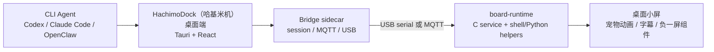

<div align="center">
  
  <h1>HachimoDock（哈基米机）</h1>
  <p><strong>放在桌上的 Agent 小屏</strong></p>
  <p>
    把 Codex、Claude Code、OpenClaw 等 CLI Agent 的状态变成桌上小宠物的表情、动作、字幕和提醒。
  </p>
  <p>
    <a href="#快速开始">快速开始</a>
    · <a href="#硬件方案">硬件方案</a>
    · <a href="#软件架构">软件架构</a>
    · <a href="#复刻与部署">复刻与部署</a>
    · <a href="#常见问题">常见问题</a>
  </p>
  <p>
    
    
    
  </p>
</div>


## 项目简介

HachimoDock（哈基米机）是一套桌面端管理器 + 小屏设备端运行时。它把电脑里正在运行的 Agent 状态同步到桌面小屏上，让 AI 工作状态从终端窗口里走出来，变成一只可以抬头看见、可以触摸互动、可以语音唤起的小搭子。

这个仓库包含两条主线：

| 模块 | 说明 |
|---|---|
| `ref/` | Tauri 2 + React 桌面端。负责设备绑定、Agent 检测与跟随、形象管理、组件中心、语音入口、按钮配置、USB/MQTT 下发和本地 bridge sidecar。 |
| `board-runtime/` | Raspberry Pi / Radxa Cubie A7Z 设备端运行时。负责显示宠物动画、接收桌面端状态、处理输入、运行负一屏 widget 和配网页面。 |

## 核心亮点

| 能力 | 说明 |
|---|---|
| Agent 状态跟随 | Agent 思考、执行工具、等待确认、完成或报错时，设备屏会显示对应表情、动作、颜色和短标签。 |
| 桌面小屏常驻 | 不用切窗口，抬头就能看到当前 Agent 是否还在工作、是否需要用户决策。 |
| 自定义宠物形象 | 内置西高地小狗状态动画，也可以导入或生成自己的宠物形象。 |
| 负一屏组件 | 内置摸鱼倒计时、番茄钟、喝水提醒、Token 消耗等 `.clawpkg` 组件，并支持自然语言生成新组件。 |
| 多链路通信 | Raspberry Pi 方案支持 USB gadget 直连；Radxa A7Z 方案当前默认走 Wi-Fi + MQTT/SSH。 |
| 语音与实体交互 | Raspberry Pi 方案已验证触摸、旋钮/按钮和语音链路；Radxa A7Z 方案保留硬件与软件扩展位。 |

## 硬件方案

| 方案 | 推荐用途 | 当前已验证 | 当前未默认启用 |
|---|---|---|---|
| 方案一：Radxa Cubie A7Z | 默认复刻硬件，性能更高，适合走 Wi-Fi + MQTT/SSH 部署 | Debian 11/12、SPI ILI9341 LCD、framebuffer 显示、HTTP/MQTT、负一屏 widget、桌面端状态同步 | XPT2046/PEN 触摸 overlay、GPIO 旋钮/按钮、板端语音 PTT、USB gadget `/dev/ttyGS0` |
| 方案二：Raspberry Pi Zero 2 W | 兼容方案，适合完整体验触摸、旋钮、语音和 USB 直连 | Raspberry Pi OS、SPI ILI9341 LCD、XPT2046/ADS7846 触摸、GPIO 旋钮/按钮、VoiceHAT 语音、USB gadget、HTTP/MQTT、负一屏 widget、桌面端状态同步 | 无线和音频效果仍取决于实际镜像、声卡和网络配置 |

`ESP32` 不是当前 `board-runtime/` 已支持目标；如需使用，需要另起移植工程。

## 软件架构



桌面端读取 Agent session、归一化状态和字幕，再通过 USB serial 或 MQTT 下发到设备端。设备端 `board-server` 写入 `.current-state`、`.current-speech`、`.stats-display` 等本地状态文件，显示进程、输入进程和 widget runtime 通过这些文件协作。

## 快速开始

### 启动桌面端

```sh
git clone https://github.com/YizhengWw/HachimoDock.git
cd HachimoDock/ref
npm install
npm run dev
```

只调试前端页面时：

```sh
cd ref
npm run dev:web
```

构建桌面应用：

```sh
cd ref
npm run build
```

更多说明见 [ref/README.md](ref/README.md)。

### 编译设备端

```sh
cd board-runtime
cmake -S . -B /tmp/board-runtime-build-check
cmake --build /tmp/board-runtime-build-check --target board-server
```

更多说明见 [board-runtime/README.md](board-runtime/README.md)。

## 复刻与部署

### Raspberry Pi

```sh
cd board-runtime
export BOARD_HOST="<pi-user>@<pi-ip>"
HOST="$BOARD_HOST" sh scripts/deploy-rpi.sh
```

### Radxa Cubie A7Z

macOS / Linux / WSL / Git Bash：

```sh
cd board-runtime
HOST=radxa@<board-ip> SUDO_PASSWORD=<sudo-password> CONFIGURE_SPI_LCD=1 sh scripts/deploy-radxa-a733.sh
```

Windows PowerShell：

```powershell
cd board-runtime
powershell -NoProfile -ExecutionPolicy Bypass -File .\scripts\deploy-radxa-a733.ps1 `
  -HostName radxa@<board-ip> `
  -SudoPassword <sudo-password> `
  -ConfigureSpiLcd
```

设备 IP、用户名、密码、board id 和 desktop id 不要写死在文档或业务代码里。调试具体板子时使用 `BOARD_HOST="<pi-user>@<pi-ip>"` 和 `BOARD_IP="<pi-ip>"`。

部署细节见 [board-runtime/DEPLOY.md](board-runtime/DEPLOY.md)，安全部署与鉴权见 [board-runtime/docs/security-hardening.md](board-runtime/docs/security-hardening.md)。

## 常见问题

### 一定要用 Radxa Cubie A7Z 吗？

不是。当前文档同时照顾 Radxa Cubie A7Z 和 Raspberry Pi Zero 2 W。A7Z 是默认复刻硬件，性能更高；Pi 方案更适合完整体验 USB gadget、触摸、旋钮/按钮和语音链路。

### 支持哪些 Agent？

面向 CLI Agent 设计，内置适配 Codex、Claude Code、OpenClaw 等。状态协议开放，第三方 Agent 也可以接入。

### 设备一定要联网吗？

取决于方案。Raspberry Pi 可走 USB gadget 直连；Radxa A7Z 当前默认走 Wi-Fi + MQTT/SSH，需要网络。

### 能自己加组件吗？

可以。组件中心使用 `.clawpkg` 结构，内置 skill 可以根据自然语言生成负一屏组件，并在 USB 或 SSH/MQTT 链路可用时下发到设备。

## 文档

| 文档 | 内容 |
|---|---|
| [docs/developer-setup_zh_Hans.md](docs/developer-setup_zh_Hans.md) | 从零搭建桌面端和设备端开发环境。 |
| [ref/README.md](ref/README.md) | 桌面端结构、开发命令和通信说明。 |
| [board-runtime/README.md](board-runtime/README.md) | 设备端模块、构建、部署和调试入口。 |
| [board-runtime/DEPLOY.md](board-runtime/DEPLOY.md) | Raspberry Pi / Radxa A7Z 部署细节。 |
| [docs/voice-architecture.md](docs/voice-architecture.md) | 桌面端、Agent bus 和板端语音链路设计。 |
| [docs/open-source-compliance-prep.md](docs/open-source-compliance-prep.md) | 开源合规与第三方资源检查记录。 |

## 验证

```sh
cd ref
npm test
npm run build
```

```sh
cd board-runtime
cmake -S . -B /tmp/board-runtime-build-check
cmake --build /tmp/board-runtime-build-check --target board-server
```

设备端部署后检查：

```sh
export BOARD_HOST="<board-user>@<board-ip>"
export BOARD_IP="<board-ip>"
ssh "$BOARD_HOST" 'systemctl is-active board-runtime'
curl -fsS http://$BOARD_IP/board-runtime-config.json
```

## License

Copyright (C) 2026 wangwu50.

This project is licensed under the GNU General Public License version 3 only (`GPL-3.0-only`). See [LICENSE](LICENSE) for the full license text and [COPYRIGHT](COPYRIGHT) for the copyright notice.
