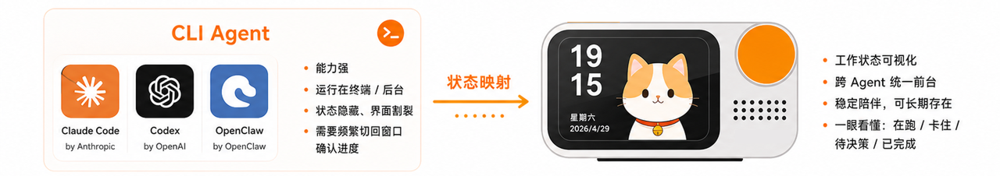
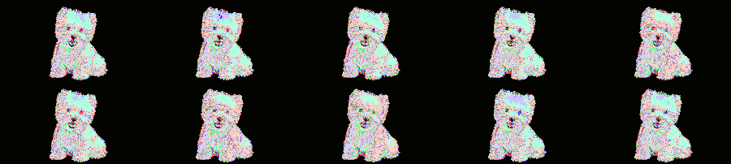
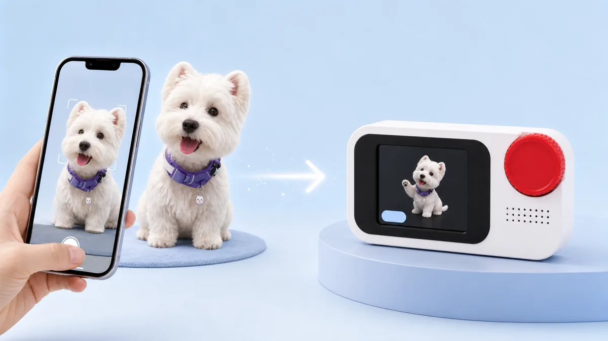
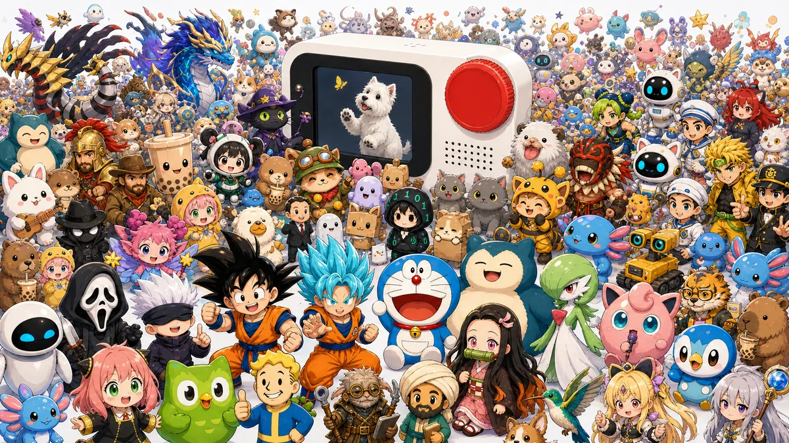

<div align="center">

# Hachimiao

[English](README.en.md) | 简体中文

Agent 的专属小屏：桌面常驻、实体陪伴，把 CLI Agent 的状态与回应变成可见、可触碰的桌面宠物。

<p>
  
  
  
  
  
</p>



</div>

## 目录

- [1. 项目简介](#1-项目简介)
- [2. 核心亮点](#2-核心亮点)
- [3. 软件开发](#3-软件开发)
- [4. 硬件复刻](#4-硬件复刻)
- [5. 使用指南](#5-使用指南)
- [6. 附录与维护](#6-附录与维护)

## 1. 项目简介

Hachimiao 是 Agent 的专属小屏。它将 PC 上运行的各类 Agent（Codex、Claude Code、OpenClaw 等）具象为工位上一只可见、可触碰的桌面宠物。

Agent 在思考，它跟着思考；Agent 在调工具，它开始工作；任务完成它庆祝，任务报错它发愁。它不是一个停留在屏幕里的“虚拟”助理，而是有状态、有回应、有存在感的 AI 搭子。

| 项目实拍 | 系统组成 |
| --- | --- |
| ![Desktop companion][img-intro-1] | ![System overview][img-intro-2] |

| 抬头可见 | 开口即用 |
| --- | --- |
| 把 Agent 的状态、进度、待决策事项和任务结果翻译成前台可见的宠物行为。看一眼设备上的表情、动作和短标签，就能知道 Agent 正在做什么。 | 不必先打开电脑窗口、寻找 IM 聊天框或切回终端，开口即可和 Agent 对话、下命令，覆盖办公、写作、开发、查资料和记录想法等场景。 |

## 2. 核心亮点

### Agent 状态跟随

桌面端与硬件屏宠物状态实时同步，用表情、动作、颜色和短标签表达 Agent 状态；在 Agent 状态变化时提供字幕、轻提醒和提示信息。

![Agent status demo][img-status-gif]

| 状态展示 | 信息提示 |
| --- | --- |
| ![Status screen 1][img-status-1] | ![Status screen 2][img-status-2] |

### 空闲与触摸反馈

在 Agent 空闲时，pet 会自己玩耍，呈现多种待机状态。用户也可以触摸屏幕和 pet 互动。

<p align="center">
  
</p>

### Agent 语音交互

支持通过设备的麦克风与 Agent 的任意 session 对话，减少在终端和聊天窗口之间切换的成本。

### 自定义形象

内置西高地小狗形象（16 个状态动画），也可以通过上传宠物照片、头像或原创角色生成新形象，并支持从本机 Codex pet 库或 pet 社区导入其它形象。

| 形象生成 | 形象集合 |
| --- | --- |
|  |  |

### 自定义组件

内置摸鱼倒计时、番茄钟、喝水提醒、Token 消耗四个组件；支持用自然语言一句话生成新组件并下发到设备。

| 组件中心 | 组件预览 |
| --- | --- |
| ![Component center][img-components-1] | ![Component preview][img-components-2] |

## 3. 软件开发

Hachimiao 软件由 PC 管理端和设备端运行时组成：

- **Pet Manager 桌面端**：基于 Tauri 2、React 和 Vite，负责设备绑定、Agent 状态跟随、形象管理、组件中心、按钮配置、语音入口和连接诊断。
- **设备端运行时**：运行在 Raspberry Pi 设备上，负责屏幕展示、触摸/旋钮/按钮输入、状态接收、组件运行和本地资源管理。
- **Agent 接入层**：从 Codex、Claude Code、OpenClaw 等本机 CLI Agent 获取 session 状态、工具调用、等待确认、token 消耗等信息，再通过 USB serial 或 MQTT 下发到设备。

```text
CLI Agent
  |  Codex / Claude Code / OpenClaw session state
  v
Pet Manager desktop app
  |  device binding, appearance, component, button config
  |  USB serial or MQTT
  v
Board runtime on Raspberry Pi
  |  state files, widget runtime, touch/rotary/button input
  v
Hachimiao hardware display
```

### 3.1 快速开始

> 下面命令面向开发者；如果只想复刻硬件并使用现成安装包，可跳到 [5. 使用指南](#5-使用指南)。

```bash
git clone <your-repo-url>
cd claw-pet-manager/ref
npm install
npm run dev
```

常用脚本：

| 命令 | 说明 |
| --- | --- |
| `npm run dev` | 启动 Tauri 桌面端开发环境 |
| `npm run dev:web` | 仅启动 Vite Web 预览 |
| `npm run build` | 构建 Tauri 桌面端安装包 |
| `npm run build:web` | 构建 Web 静态资源 |
| `npm run pack-builtins` | 打包内置 `.clawpkg` 组件 |

### 3.2 开发环境

- Node.js 与 npm。
- Rust 与 Tauri 2 构建环境。
- 可用的本机 CLI Agent：Codex、Claude Code、OpenClaw 等。
- 可连接设备的 USB serial 或可访问 MQTT broker 的局域网环境。
- Raspberry Pi Zero 2 WH 设备端运行环境。

### 3.3 仓库结构

```text
claw-pet-manager/
  ref/                  Pet Manager 桌面端（Tauri 2 + React + Vite）
    src/                React UI：设备向导、仪表盘、形象画廊、组件中心、语音配置
    src-tauri/          Tauri + Rust 后端：本地文件、bridge、USB/MQTT 下发、组件安装
    builtin-clawpkgs/   内置负一屏组件源目录
  board-runtime/        Raspberry Pi 设备端运行时（C / shell / Python）
    src/                board-server 等设备端服务
    builtin-clawpkgs/   设备端内置组件源目录
    ui/ assets/         配网页面、字体和设备端资源
  scripts/              仓库级脚本，例如内置 .clawpkg 打包
  skills/               组件中心使用的 Agent skill
  docs/                 架构、语音链路、打包和二次开发文档
```

### 3.4 开放规范

后续重点开放和维护四类规范：

1. **Agent 状态协议**：第三方 Agent 如何把工作状态、字幕、token、工具调用与等待确认状态传给桌宠与小屏。
2. **设备端通信 / SDK**：桌面端经 USB serial 行协议或 MQTT 下发状态，支持不同硬件、语言与 Agent 接入。
3. **形象 / 动画规范**：让社区制作的宠物资源可复用，并兼容 Codex Pet 生态。
4. **`.clawpkg` 组件规范**：让负一屏组件可以被生成、安装、分享和复用。

一个 `.clawpkg` 组件包建议包含：

```text
component.json        组件元数据（id / name / version / author / description）
buttons.json          按钮功能绑定
negative-screen.json  负一屏显示配置
runtime/widget.json   声明式状态机（vars / states / transitions / tick / dashboard）
share.json            分享 / 导出元数据
assets/               图标等资源
```

## 4. 硬件复刻

硬件复刻资料已拆分为独立文档，便于维护 BOM、结构件、装配图和 PCB 工艺信息。

- [查看硬件复刻文档](docs/hardware-reproduction.md)
- [嘉立创开源硬件项目](https://oshwhub.com/eda_lfilxkob/project_ukwrttbk)
- 覆盖内容：整机 BOM、采购说明、结构件与装配、PCB 工艺信息。

## 5. 使用指南

使用指南已拆分为独立文档，并补充了 Word 文档中的完整软件截图。

- [查看使用指南](docs/user-guide.md)
- 覆盖内容：设备绑定、Pet Manager 管理端、形象画廊、自定义形象、组件中心和 AI 生成组件流程。

## 6. 附录与维护

### 6.1 Contributing

欢迎通过 GitHub issue、discussion 和 pull request 参与项目。建议贡献方向：

- 修复 Pet Manager 或板端运行时问题。
- 适配新的硬件屏、主控板、结构件或外壳形态。
- 创作宠物资源、动画素材和字幕样式。
- 开发新的 `.clawpkg` 负一屏组件。
- 补充装配教程、烧录说明和故障排查。
- 改进 Agent 状态协议和第三方 Agent 接入。

贡献流程、许可证义务和 CLA 计划见 [CONTRIBUTING.md](CONTRIBUTING.md)。

### 6.2 License

本项目采用软硬件分层授权：

- 软件代码：`GPL-3.0-only`
- 硬件设计：`CERN-OHL-S-2.0`
- 3D 结构件：以随模型文件发布的授权说明为准。
- 官方宠物素材：仅随本项目示例和演示使用，复用或二次分发前请保留来源说明。
- 第三方资源：若引入外部模型、素材、组件或库，请在对应文件或后续 `THIRD_PARTY_NOTICES.md` 中补充声明。

`GPL-3.0-only` 与 `CERN-OHL-S-2.0` 都是 reciprocal / copyleft 风格的许可证：基于本项目开源内容做修改并对外分发时，需要按对应许可证公开修改内容；但这不等于必须向本仓库提交 PR。你可以维护自己的 fork 或派生项目，只要满足相应许可证要求。

正式开放外部贡献后，项目计划搭建 CLA 流程，以便合规接受外部开发者贡献。

完整授权说明见 [LICENSE.md](LICENSE.md)，许可证正文见 [LICENSES/](LICENSES/)。

### 6.3 Security Issues

如果发现安全问题，请不要直接公开敏感细节。当前优先在社群中联系项目维护者确认处理方式；若只能通过 GitHub issue 反馈，请先描述影响范围，不要贴出可复现的敏感细节。后续若启用 GitHub Security Advisory 或专用安全邮箱，请以仓库最新说明为准。

### 6.4 项目入口

- GitHub：<https://github.com/Skylerww/Hachimiao>
- 嘉立创开源硬件项目：<https://oshwhub.com/eda_lfilxkob/project_ukwrttbk>
- 社区 / 交流群：扫描下方二维码加入。

<p align="center">
  
</p>

### 6.5 致谢

- 感谢嘉立创 / 立创生态、OpenClaw、MiMo、Petdex / Codex Pet 及相关开源项目和社区贡献者。

<!-- Images -->

[img-intro-1]: assets/image_02.jpeg
[img-intro-2]: assets/readme/intro-system-overview.webp
[img-status-gif]: assets/image_04.gif
[img-status-1]: assets/readme/status-screen-1.webp
[img-status-2]: assets/readme/status-screen-2.webp
[img-components-1]: assets/image_10.jpeg
[img-components-2]: assets/readme/component-preview.webp

<!-- Purchase links -->

