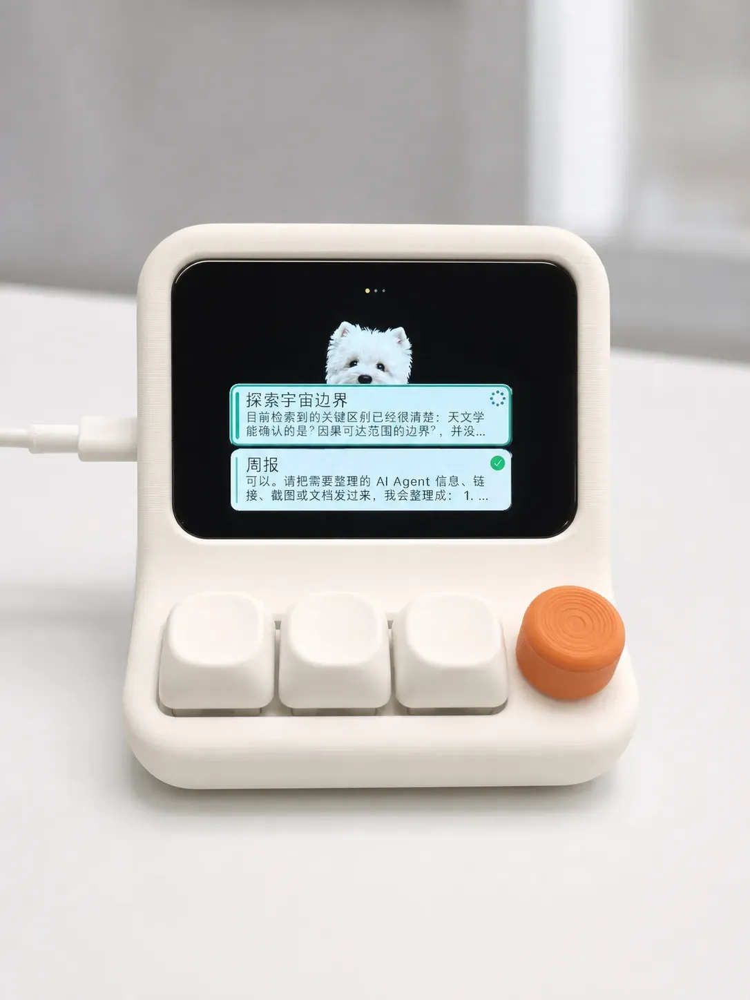
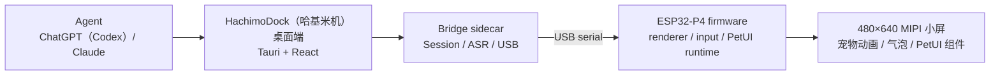

  
  <h1>HachimoDock（哈基米机）</h1>
  
<strong>哈基米机 HachimoDock：让你的宠物 / 朋友 / 你推变成 AI Agent，和你一起工作</strong>

  

    把 ChatGPT（Codex）、Claude 等 Agent 的实时工作状态变成桌上宠物的表情、动作、Session 气泡和提醒。
  

  

    
  

  

    <a href="#硬件方案">硬件方案</a>
    · <a href="#硬件端资料">硬件端资料</a>
    · <a href="#图集">图集</a>
    · <a href="#软件架构">软件架构</a>
    · <a href="#复刻与部署">复刻与部署</a>
    · <a href="#快速开始">快速开始</a>
    · <a href="#常见问题">常见问题</a>
  

  

    
    
    
  

  

    
    
  

## 项目简介

HachimoDock（哈基米机）是一套桌面端管理器、ESP32-P4 小屏固件和开源硬件方案。它把电脑里正在运行的 Agent Session 实时同步到桌面小屏，让 AI 的思考、执行、完成和报错状态变成看得见的宠物动画与气泡；实体按键、四向摇杆和麦克风又能把操作与语音送回 Agent。

你可以在这里下载 Windows/macOS 客户端和 ESP32-P4 完整烧录包，也可以获取源码自行构建。硬件资料与装配教程见 OSHWHub。

| 端 | 入口 | 说明 |
|---|---|---|
| 软件端 | [GitHub Releases](https://github.com/YizhengWw/HachimoDock/releases/latest) | Windows x64 与 Apple silicon macOS 客户端。负责设备绑定、Agent 检测与跟随、形象管理、组件中心、语音入口、按钮配置和 USB 下发。 |
| 固件端 / 设备运行时 | [GitHub Releases](https://github.com/YizhengWw/HachimoDock/releases/latest) | ESP32-P4 完整出厂镜像，包含应用固件、默认形象和内置组件。 |
| 硬件端 | [OSHWHub 硬件复刻页面](https://oshwhub.com/eda_gqvzlprk/project_cnbmkbjc#3-%E7%A1%AC%E4%BB%B6%E5%A4%8D%E5%88%BB) | PCB、BOM、结构/装配和硬件复刻资料。 |

## 图集

<table>
  <tr>
    <td width="50%">
      
       
      桌面小屏实拍：把 Agent 状态放到工位视野里。
    </td>
    <td width="50%">
      
       
      新版三按键与四向摇杆机身，屏幕显示内置西高地形象。
    </td>
  </tr>
</table>

## 核心亮点

| 能力 | 说明 |
|---|---|
| Agent 状态跟随 | Agent 思考、执行工具、等待确认、完成或报错时，设备屏会显示对应表情、动作、颜色和短标签。 |
| 桌面小屏常驻 | 不用切窗口，抬头就能看到当前 Agent 是否还在工作、是否需要用户决策。 |
| 自定义宠物形象 | 内置西高地小狗状态动画，也可以导入或生成自己的宠物形象。 |
| PetUI 组件中心 | 内置接住星星、Flappy Bird、像素方块、像素贪食蛇、番茄钟、喝水提醒和 Token 仪表盘，并支持通过 Agent Skill 生成新组件。 |
| USB 直连 | PC 与 ESP32-P4 通过 USB 串行协议同步状态、按钮配置、形象和组件，无需设备加入局域网。 |
| 语音与实体交互 | 三个按键的短按/长按、摇杆四向与中键短按/长按均可配置；长按语音键可把 ASR 文本发送到当前 Agent Session。 |

## 桌面软件

桌面端不是一个简单的串口烧录工具，而是 HachimoDock 的管理与 Agent 路由中心。当前版本支持 Windows 与 Apple silicon macOS，预编译安装包可从 GitHub Releases 下载。

| 页面 / 模块 | 当前能力 |
|---|---|
| 设备首页 | 自动发现并识别 ESP32-P4，不依赖固定 COM 端口；显示连接、固件、Flash/PSRAM、资源与传输状态，并提供重连、诊断和固件维护入口。 |
| Agent 跟随 | 跟随 ChatGPT（Codex）或 Claude；自动读取正在工作的 Session，并将标题、摘要和 working/done/error 状态同步为设备气泡。 |
| Session 切换 | 摇杆左右切换设备气泡时，桌面端同步把对应 Agent 和 Session 拉到前台；已显示任务完成或报错后保留 60 秒再消失。 |
| 形象管理 | 内置西高地形象；支持 AI 生成、Codex 社区形象导入和本地视频导入；在传输前完成面向 P4 的裁切、转码和资源校验。 |
| 形象同步 | 设备保留一个固定西高地槽和一个可替换形象槽；下发保持原始宽高比，避免拉伸，并显示传输进度与失败原因。 |
| PetUI 组件中心 | 统一管理 PC 与设备组件，卡片直接显示“同步到设备”或“已同步到设备”；支持安装、移除、预览和容量校验。 |
| PetUI Skill | 用户在 Agent 中调用 `petui` Skill 生成游戏或工具，经过结构、字节预算和设备能力校验后原子发布到组件库。 |
| 按键与摇杆 | SW1/SW2/SW3 的短按、长按，以及摇杆上、下、左、右、中键短按/长按均可绑定动作；配置通过 USB 下发并持久化。 |
| 语音输入 | 长按语音键录音，桌面端调用 ASR；有气泡时输入对应 Session，无气泡时唤起当前跟随的 Agent 并输入当前会话。 |
| API 设置 | 集中配置语音识别和形象生成服务的凭据；密钥只保存在本机应用配置中，不写入固件和仓库。 |

### Session 气泡规则

- 扫描时处于 working/thinking/tool-running 等活跃状态的 Session 才会新增到设备。
- 已经显示在设备上的活跃 Session 会持续接收后续状态变化，不会因一次扫描遗漏而立即消失。
- Session 进入 done 或 error 后保留 60 秒；idle、历史完成任务和 Agent 内部会话不会作为新气泡下发。
- 气泡数量由 Agent 当前活跃 Session 自动决定，不需要用户手动配置。

<table>
  <tr>
    <td width="50%"></td>
    <td width="50%"></td>
  </tr>
  <tr>
    <td>气泡自动对应当前正在工作的 Agent Session。</td>
    <td>长按按键录音，把 ASR 文字送入目标 Session。</td>
  </tr>
</table>

### PetUI 组件工作流

1. 在 ChatGPT（Codex）或 Claude 中调用 `petui` Skill，并描述希望生成的小游戏或工具。
2. Skill 按 480×640 屏幕、三个按键和四向中按摇杆的设备能力生成组件，不套用固定游戏外壳。
3. 校验脚本检查 manifest、状态机、按钮映射、资源路径和设备字节限制，再原子发布到统一组件库。
4. 桌面端自动读取组件库，用户在组件卡片上直接同步到设备或从 PC/设备双端删除。

### 状态跟随与互动

  
   
  Agent 状态变化时，宠物动画随之变化。

### 自定义形象与组件

上传本地视频、导入社区形象，或使用 AI 生成自己的宠物动作；通过 `petui` Skill 还可以创建番茄钟、喝水提醒、Token 仪表盘和小游戏。新机型对应的形象管理与组件中心截图将在完整代码同步后补充。

## 硬件方案

本仓库给出软件和固件配套；PCB、BOM、硬件装配和复刻资料请看：
[OSHWHub 硬件端页面](https://oshwhub.com/eda_gqvzlprk/project_cnbmkbjc#3-%E7%A1%AC%E4%BB%B6%E5%A4%8D%E5%88%BB)。

| 模块 | 当前方案 |
|---|---|
| 主控 | ESP32-P4，RISC-V 双核，HP 最高 400MHz |
| 存储 | 32MB Flash，32MB PSRAM |
| 屏幕 | 2.8 英寸 480×640 MIPI-DSI，竖屏显示 |
| 输入 | 3 个实体按键 + 1 个四向中按摇杆，共 12 种可配置手势 |
| 音频 | 板载麦克风语音采集，桌面端 ASR 与 Agent 输入路由 |
| 连接 | USB-UART 用于烧录、日志和日常数据传输；硬件保留原生 USB HS OTG 能力 |
| 扩展 | PetUI 通用小组件/小游戏运行时，组件通过桌面端同步到设备 |

## 硬件端资料

硬件端不只是一张接线图，包含从主控、屏幕、PCB、外壳到装配的复刻路径：

| 内容 | 入口 |
|---|---|
| 硬件复刻总入口 | [OSHWHub 项目页](https://oshwhub.com/eda_gqvzlprk/project_cnbmkbjc#3-%E7%A1%AC%E4%BB%B6%E5%A4%8D%E5%88%BB) |
| 桌面客户端与完整固件 | [GitHub Releases](https://github.com/YizhengWw/HachimoDock/releases/latest) |
| 完整性校验 | 每个 Release 附带 `SHA256SUMS` 与 `release-manifest.json` |

## 软件架构

```mermaid
flowchart LR
  agent["Agent<br/>ChatGPT（Codex）/ Claude"]
  desktop["HachimoDock（哈基米机）桌面端<br/>Tauri + React"]
  bridge["Bridge sidecar<br/>Session / ASR / USB"]
  board["ESP32-P4 firmware<br/>renderer / input / PetUI runtime"]
  screen["480×640 MIPI 小屏<br/>宠物动画 / 气泡 / PetUI 组件"]

  agent --> desktop
  desktop --> bridge
  bridge -->|"USB serial"| board
  board --> screen
```

桌面端读取并归一化 Agent Session，将正在设备上显示的活跃任务及其状态变化通过 USB 下发。ESP32-P4 固件负责动画和气泡生命周期、输入事件、资源双槽以及 PetUI 组件运行；设备输入则由桌面端路由回对应 Agent。

## 复刻与部署

硬件复刻请从 [OSHWHub 硬件端页面](https://oshwhub.com/eda_gqvzlprk/project_cnbmkbjc#3-%E7%A1%AC%E4%BB%B6%E5%A4%8D%E5%88%BB) 开始，页面提供 PCB、BOM、结构与装配资料。设备端采用完整 ESP32-P4 镜像，镜像同时包含应用固件、分区表、内置西高地形象和默认 PetUI 组件，避免首次安装后缺少资源。

首次烧录建议先擦除整片 Flash，再从地址 `0x0` 写入 Release 中的完整出厂镜像；日常升级请使用 Pet Manager 的固件升级功能。完整镜像会覆盖设备设置、形象和组件，仅应在新设备或明确恢复出厂时使用。

## 快速开始

### 安装桌面端

前往 [最新 Release](https://github.com/YizhengWw/HachimoDock/releases/latest)：

- Apple silicon Mac 下载 `HachimoDock-Pet-Manager_0.1.52_macOS-arm64.dmg`；
- Windows x64 下载 `HachimoDock-Pet-Manager_0.1.52_Windows-x64-setup.exe`；
- 安装后连接设备，Pet Manager 会自动识别 ESP32-P4，并提供固件升级、形象和组件同步入口。

公开安装包不内置 ASR 或内容生成 API Key；需要相关能力时请在 Pet Manager 的“API 配置”中填写自己的服务凭据。

### 新设备或恢复出厂

Release 中的 `HachimoDock-P4_*_factory.bin` 是从 `0x0` 开始烧录的完整镜像，并附带同名 JSON 分区/校验清单。烧录前请确认目标确实是 HachimoDock ESP32-P4 设备；完整镜像会覆盖设备现有数据。

## 常见问题

### 这个 GitHub 仓库包含什么？

提供软件端和固件端的正式二进制文件：

- 软件端：Windows x64 与 Apple silicon macOS 安装包。
- 固件端 / 设备运行时：可烧录到 ESP32-P4 的完整出厂镜像与清单。
- 硬件端：PCB、BOM、装配和复刻资料在 [OSHWHub 硬件端页面](https://oshwhub.com/eda_gqvzlprk/project_cnbmkbjc#3-%E7%A1%AC%E4%BB%B6%E5%A4%8D%E5%88%BB)。

### 一定要使用 ESP32-P4 吗？

当前固件、完整镜像、MIPI 显示、资源分区和 USB 协议均针对 ESP32-P4 实现。更换主控需要重新适配显示、输入、存储布局和桌面端通信协议。

### 屏幕、麦克风、喇叭和摇杆能换型号吗？

可以，但必须确认接口、电压、排线定义和初始化序列。当前固件按 2.8 英寸 480×640 MIPI-DSI 屏、三个按键、GPIO20/GPIO21 双轴与 GPIO4 中键摇杆和配套音频电路适配；GPIO2/GPIO3 的旧旋钮输入仍保留兼容。仅仅驱动 IC 相同不代表屏幕或输入器件可以直接互换。

### 屏幕一定要带触摸吗？

不需要。当前产品交互以三个实体按键、四向摇杆和语音为主，固件不依赖触摸屏。

### 必须做定制 PCB 底板吗？

不是必须。定制 PCB 主要是为了减少杜邦线、让结构更整洁。调试阶段可以先用杜邦线直连；想做成完整产品形态时再按 OSHWHub 的硬件资料打样。

### 大概成本多少？

成本取决于 ESP32-P4 主板、MIPI 屏、PCB、音频器件、摇杆按键、外壳和打样数量，请以硬件复刻页面的最新 BOM 为准。

### 支持哪些 Agent？

当前重点适配 ChatGPT（Codex）和 Claude 桌面 Agent，并通过本地 bridge 读取 Session、切换会话和路由语音输入。状态协议保持可扩展，后续可以接入更多 Agent。

### 设备一定要联网吗？

设备状态、形象和组件同步走 USB，不要求 ESP32-P4 加入局域网。语音识别、Agent 本身以及 AI 形象或组件生成仍可能需要电脑联网。

### 语音交互怎么用？

按住绑定的语音输入键开始录音，松开后由桌面端完成 ASR，并把文字注入当前气泡对应的 Agent Session。设备没有气泡时，桌面端会拉起当前跟随的 Agent，再定位其输入框。语音识别需要已配置且可用的 ASR 服务。

### 能自己加组件吗？

可以。项目提供 `petui` Skill，用户可以在 Agent 中用自然语言生成小组件或小游戏，校验并发布到统一组件库，再由桌面端通过 USB 同步到设备。

### 使用什么许可证？

当前源码采用 [HachimoDock 项目许可证](LICENSE)，仅限许可范围内的非商业用途。商业使用、商业集成或独立产品开发须另行取得权利人书面授权。允许个人非商业复刻、项目内修改，以及组件的生成、调试和分享。第三方材料继续遵循 [THIRD_PARTY_NOTICES.md](THIRD_PARTY_NOTICES.md) 中各自的许可证；历史安装包遵循其随包许可证。

### 怎么反馈问题或参与贡献？

可以在 GitHub 提 Issue 或 Discussion。硬件复刻相关问题建议同时参考 [OSHWHub 硬件端页面](https://oshwhub.com/eda_gqvzlprk/project_cnbmkbjc#3-%E7%A1%AC%E4%BB%B6%E5%A4%8D%E5%88%BB)。

## 下载完整性

每个 Release 都提供 `SHA256SUMS` 和 `release-manifest.json`。下载后请先核对 SHA-256，再安装客户端或烧录固件；不要混用不同 Release 的出厂镜像和 JSON 清单。

## 致谢 / Acknowledgements

HachimoDock 的实现参考、借鉴并集成了以下开源项目，特此致谢：

- [Clawd on Desk](https://github.com/rullerzhou-afk/clawd-on-desk) — 开源项目致谢；第三方版权与许可证见 [THIRD_PARTY_NOTICES.md](THIRD_PARTY_NOTICES.md)。
- [OpenClaw](https://github.com/openclaw/openclaw)（MIT）— CLI Agent 运行时与插件 SDK。
- [Claude Code](https://github.com/anthropics/claude-code) — 主力 coding agent 与 hook 状态协议。
- [Codex](https://github.com/openai/codex) — 被适配的 CLI Agent 之一；同时支持 Cursor、Gemini CLI、GitHub Copilot CLI 等。

## 作者 / Author

贡献者 / Contributors：Wanzheng Liu、Zinuo Tian。

- 📧 邮箱：avalon.ty@gmail.com
- 💬 微信交流群：扫描下方二维码加入

如果 HachimoDock 对你有帮助，欢迎给仓库点一个 ⭐ **Star**、点击 **Follow** 关注后续更新，也欢迎通过 Issue 提交可复现的问题与建议。

## License

Copyright (C) 2026 Yizheng Wang.

项目采用 [HachimoDock 项目许可证](LICENSE)。允许许可范围内的个人非商业使用、修改和组件创作；商业用途须另行取得书面授权。项目名称、标识及素材的相关权利仍由各权利人保留。

**重要声明：本项目仅限许可范围内的非商业用途。未经权利人书面授权，不得用于商业产品、收费服务或独立于本项目的 APP、Web 服务及其他软件、硬件产品。** 项目内非商业组件开发按许可证明确允许。

Current sources are provided under the [HachimoDock Project License](LICENSE) for permitted non-commercial purposes only. Commercial use and independent product development require prior written permission. Third-party licenses and licenses accompanying earlier releases remain applicable. See the [English overview](README.en.md).

## 源码与构建

想自行编译或修改功能？请从下方目录开始。直接使用请前往 [下载页面](https://github.com/YizhengWw/HachimoDock/releases/latest)，选择适合电脑系统的客户端和设备烧录包。

| 目录 | 内容 | 构建说明 |
|---|---|---|
| [`pc/`](pc/) | Tauri/React 客户端、Agent bridge、生成 Skill、内置形象与组件 | [PC 构建](pc/README.md) |
| [`firmware/`](firmware/) | ESP32-P4 固件、板级驱动、协议、测试与完整烧录包工具 | [固件构建](firmware/BUILD.md) |

克隆源码后，请安装 Git LFS 并运行 `git lfs pull` 获取配套素材。使用语音识别或形象生成时，在客户端的“API 配置”中填写自己的服务 Key。
