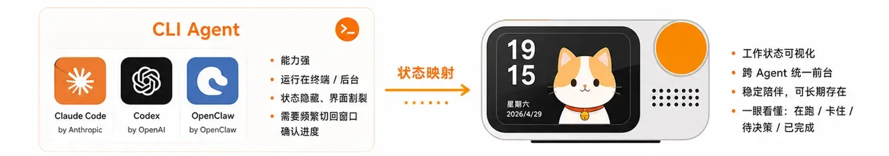
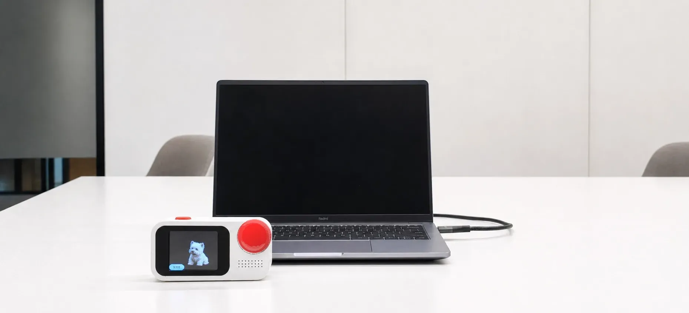
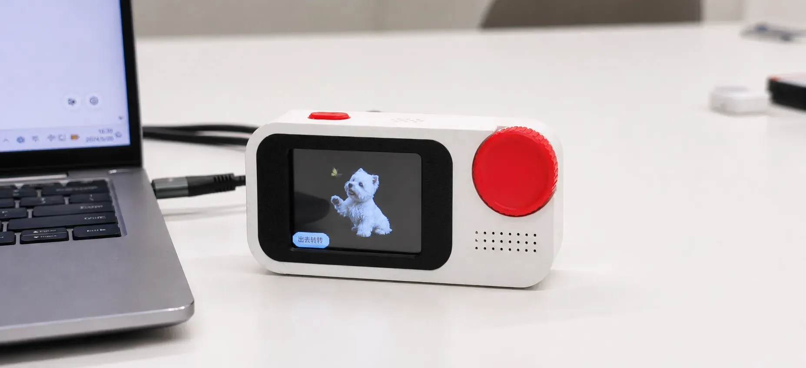
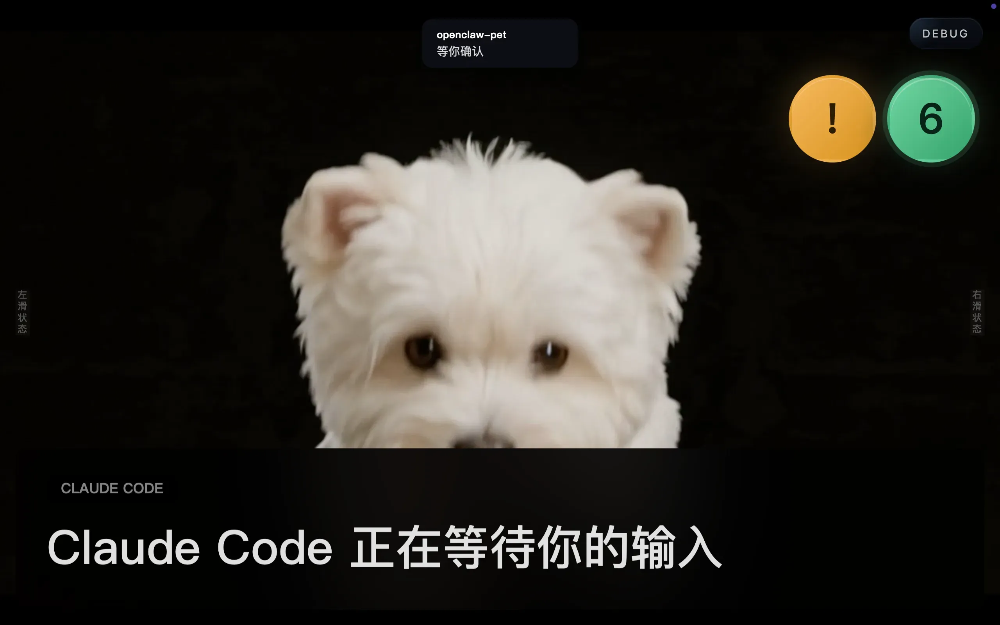
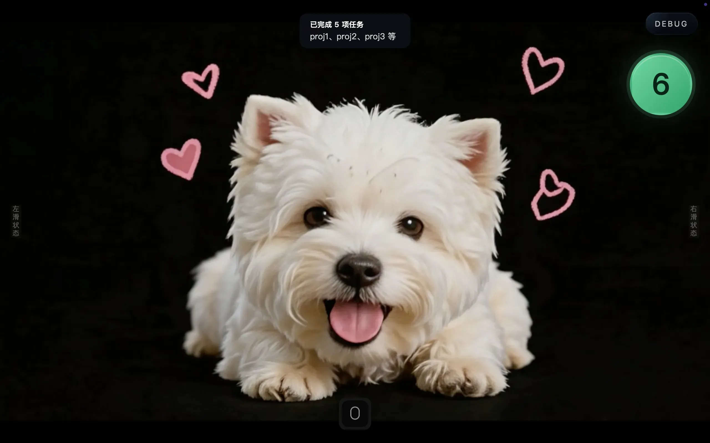
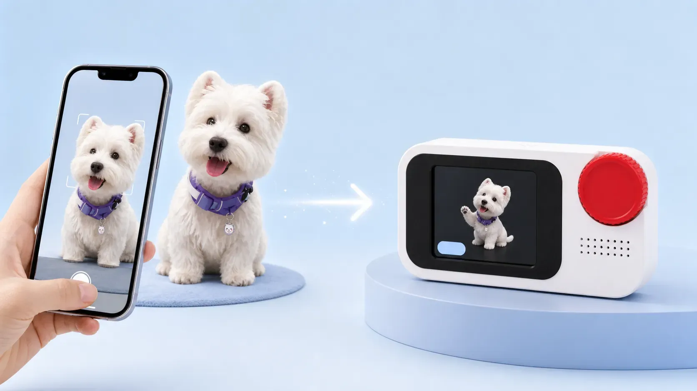
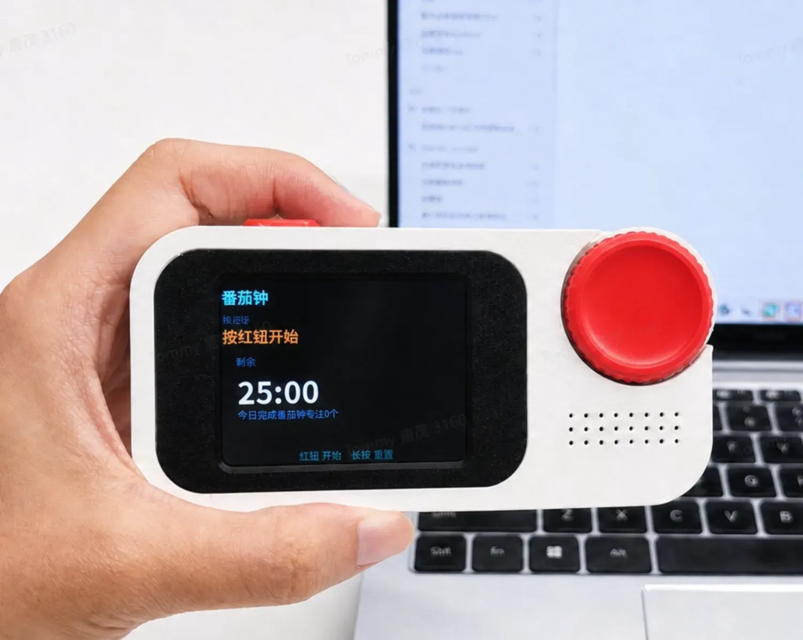
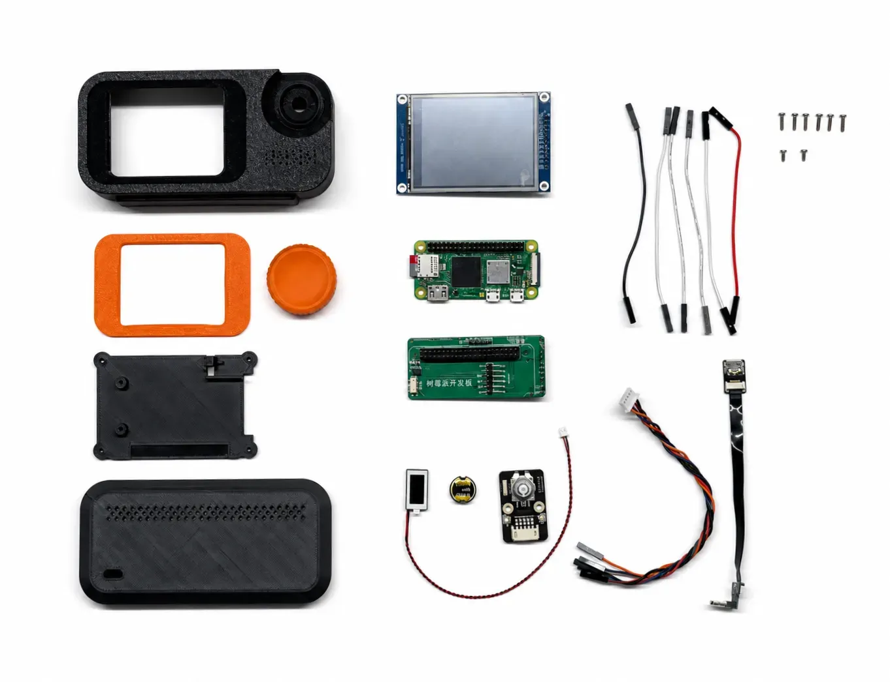
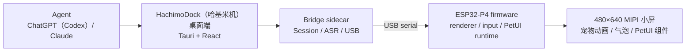
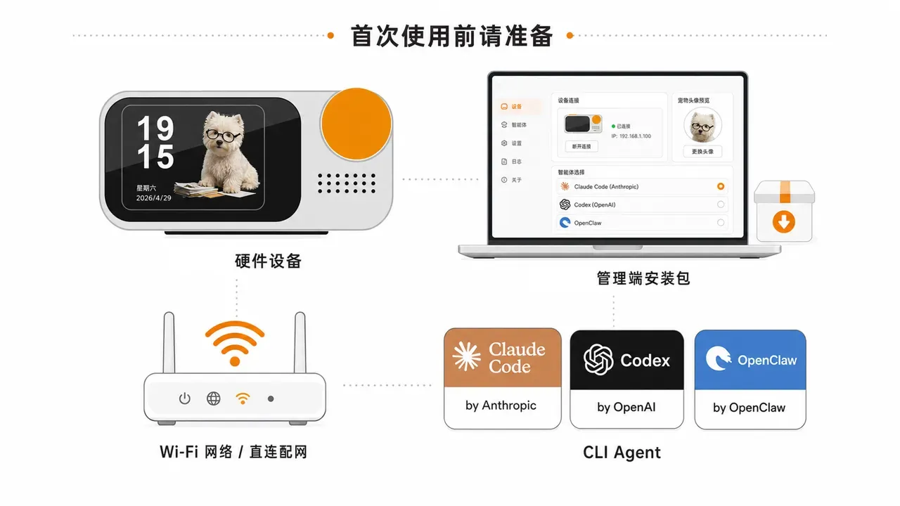

<div align="center">
  
  <h1>HachimoDock（哈基米机）</h1>
  <p><strong>哈基米机 HachimoDock：让你的宠物 / 朋友 / 你推变成 AI Agent，和你一起工作</strong></p>
  <p>
    把 ChatGPT（Codex）、Claude 等 Agent 的实时工作状态变成桌上宠物的表情、动作、Session 气泡和提醒。
  </p>
  <p>
    <a href="https://oshwhub.com/eda_gqvzlprk/project_cnbmkbjc#3-%E7%A1%AC%E4%BB%B6%E5%A4%8D%E5%88%BB">
      
    </a>
  </p>
  <p>
    <a href="#硬件方案">硬件方案</a>
    · <a href="#硬件端资料">硬件端资料</a>
    · <a href="#图集">图集</a>
    · <a href="#软件架构">软件架构</a>
    · <a href="#复刻与部署">复刻与部署</a>
    · <a href="#快速开始">快速开始</a>
    · <a href="#常见问题">常见问题</a>
  </p>
  <p>
    
    
    
  </p>
  <p>
    <a href="https://github.com/YizhengWw/HachimoDock/stargazers"></a>
    <a href="https://github.com/YizhengWw"></a>
  </p>
</div>



## 项目简介

HachimoDock（哈基米机）是一套桌面端管理器、ESP32-P4 小屏固件和开源硬件方案。它把电脑里正在运行的 Agent Session 实时同步到桌面小屏，让 AI 的思考、执行、完成和报错状态变成看得见的宠物动画与气泡；实体按键、旋钮和麦克风又能把操作与语音送回 Agent。

这个 GitHub 仓库主要托管软件端和固件端代码；硬件端资料在 OSHWHub 维护。

| 端 | 入口 | 说明 |
|---|---|---|
| 软件端 | [`ref/`](ref/) | Tauri 2 + React 桌面端。负责设备绑定、Agent 检测与跟随、形象管理、组件中心、语音入口、按钮配置、USB 下发和本地 bridge sidecar。 |
| 固件端 / 设备运行时 | `esp-p4-runtime/` | ESP32-P4 固件。负责 MIPI 屏渲染、宠物动画、Session 气泡、按键与旋钮、语音采集、PetUI 组件和 USB 协议。 |
| 硬件端 | [OSHWHub 硬件复刻页面](https://oshwhub.com/eda_gqvzlprk/project_cnbmkbjc#3-%E7%A1%AC%E4%BB%B6%E5%A4%8D%E5%88%BB) | PCB、BOM、结构/装配和硬件复刻资料。 |

## 图集

<table>
  <tr>
    <td width="50%">
      
      <br />
      <sub>桌面小屏实拍：把 Agent 状态放到工位视野里。</sub>
    </td>
    <td width="50%">
      
      <br />
      <sub>桌面端管理：设备绑定、Agent 跟随、形象和组件配置。</sub>
    </td>
  </tr>
</table>

## 核心亮点

| 能力 | 说明 |
|---|---|
| Agent 状态跟随 | Agent 思考、执行工具、等待确认、完成或报错时，设备屏会显示对应表情、动作、颜色和短标签。 |
| 桌面小屏常驻 | 不用切窗口，抬头就能看到当前 Agent 是否还在工作、是否需要用户决策。 |
| 自定义宠物形象 | 内置西高地小狗状态动画，也可以导入或生成自己的宠物形象。 |
| PetUI 组件中心 | 内置接住星星、Flappy Bird、像素方块、像素贪食蛇、番茄钟、喝水提醒和 Token 仪表盘，并支持通过 Agent Skill 生成新组件。 |
| USB 直连 | PC 与 ESP32-P4 通过 USB 串行协议同步状态、按钮配置、形象和组件，无需设备加入局域网。 |
| 语音与实体交互 | 三个按键的短按/长按、旋钮左旋/右旋/短按均可配置；长按语音键可把 ASR 文本发送到当前 Agent Session。 |

### 状态跟随与互动

<table>
  <tr>
    <td width="34%">
      
      <br />
      <sub>Agent 状态变化时，小屏同步切换表情和动作。</sub>
    </td>
    <td width="33%">
      
      <br />
      <sub>一眼识别当前状态，不必盯着终端窗口。</sub>
    </td>
    <td width="33%">
      
      <br />
      <sub>字幕和短标签提示 Agent 正在做什么。</sub>
    </td>
  </tr>
</table>

### 自定义形象与组件

<table>
  <tr>
    <td width="50%">
      
      <br />
      <sub>上传宠物照片、头像或原创角色，生成自己的桌面搭子。</sub>
    </td>
    <td width="50%">
      
      <br />
      <sub>负一屏组件承载番茄钟、喝水提醒、Token 消耗等轻量工具。</sub>
    </td>
  </tr>
</table>

## 硬件方案

本仓库给出软件和固件配套；PCB、BOM、硬件装配和复刻资料请看：
[OSHWHub 硬件端页面](https://oshwhub.com/eda_gqvzlprk/project_cnbmkbjc#3-%E7%A1%AC%E4%BB%B6%E5%A4%8D%E5%88%BB)。

| 模块 | 当前方案 |
|---|---|
| 主控 | ESP32-P4，RISC-V 双核，HP 最高 400MHz |
| 存储 | 32MB Flash，32MB PSRAM |
| 屏幕 | 2.8 英寸 480×640 MIPI-DSI，竖屏显示 |
| 输入 | 3 个实体按键 + 1 个带按压旋钮，共 8 种可配置操作 |
| 音频 | 板载麦克风语音采集，桌面端 ASR 与 Agent 输入路由 |
| 连接 | USB-UART 用于烧录、日志和日常数据传输；硬件保留原生 USB HS OTG 能力 |
| 扩展 | PetUI 通用小组件/小游戏运行时，组件通过桌面端同步到设备 |

<p align="center">
  
  <br />
  <sub>HachimoDock 的核心物料示意，具体版本以硬件复刻页面为准。</sub>
</p>

## 硬件端资料

硬件端不只是一张接线图，包含从主控、屏幕、PCB、外壳到装配的复刻路径：

| 内容 | 入口 |
|---|---|
| 硬件复刻总入口 | [OSHWHub 项目页](https://oshwhub.com/eda_gqvzlprk/project_cnbmkbjc#3-%E7%A1%AC%E4%BB%B6%E5%A4%8D%E5%88%BB) |
| 软件端和固件端 | 本 GitHub 仓库 |
| 桌面端开发说明 | [ref/README.md](ref/README.md) |
| 设备端固件 | `esp-p4-runtime/` |

## 软件架构


```mermaid
flowchart LR
  agent["Agent<br/>ChatGPT（Codex）/ Claude"]
  desktop["HachimoDock（哈基米机）桌面端<br/>Tauri + React"]
  bridge["Bridge sidecar<br/>Session / ASR / USB"]
  board["ESP32-P4 firmware<br/>renderer / input / PetUI runtime"]
  screen["480×640 MIPI 小屏<br/>宠物动画 / 气泡 / PetUI 组件"]

  agent --> desktop
  desktop --> bridge
  bridge -->|"USB serial"| board
  board --> screen
```

桌面端读取并归一化 Agent Session，将正在设备上显示的活跃任务及其状态变化通过 USB 下发。ESP32-P4 固件负责动画和气泡生命周期、输入事件、资源双槽以及 PetUI 组件运行；设备输入则由桌面端路由回对应 Agent。

## 复刻与部署

硬件复刻请从 [OSHWHub 硬件端页面](https://oshwhub.com/eda_gqvzlprk/project_cnbmkbjc#3-%E7%A1%AC%E4%BB%B6%E5%A4%8D%E5%88%BB) 开始，页面提供 PCB、BOM、结构与装配资料。设备端采用完整 ESP32-P4 镜像，镜像同时包含应用固件、分区表、内置西高地形象和默认 PetUI 组件，避免首次安装后缺少资源。

开发阶段通过板载 USB-UART 进行构建、烧录和日志调试。首次烧录建议先擦除整片 Flash，再写入完整镜像；日常升级可只更新应用固件。具体命令以 `esp-p4-runtime/` 中的构建脚本和说明为准。

## 快速开始

<p align="center">
  
  <br />
  <sub>桌面端负责绑定、跟随、形象、组件和诊断。</sub>
</p>

### 启动桌面端

```sh
git clone https://github.com/YizhengWw/HachimoDock.git
cd HachimoDock/ref
npm install
npm run dev
```

只调试前端页面时：

```sh
cd ref
npm run dev:web
```

构建桌面应用：

```sh
cd ref
npm run build
```

更多说明见 [ref/README.md](ref/README.md)。

### 构建设备端

设备固件基于 ESP-IDF。同步完整代码后，进入 `esp-p4-runtime/`，按目录内说明配置 ESP-IDF、构建完整镜像并通过串口烧录。不要只复制单个 app 分区作为首次安装包。

## 常见问题

### 这个 GitHub 仓库包含什么？

包含软件端和固件端：

- 软件端：`ref/`，也就是 HachimoDock（哈基米机）桌面管理器。
- 固件端 / 设备运行时：`esp-p4-runtime/`，构建并烧录到 ESP32-P4。
- 硬件端：PCB、BOM、装配和复刻资料在 [OSHWHub 硬件端页面](https://oshwhub.com/eda_gqvzlprk/project_cnbmkbjc#3-%E7%A1%AC%E4%BB%B6%E5%A4%8D%E5%88%BB)。

### 一定要使用 ESP32-P4 吗？

当前固件、完整镜像、MIPI 显示、资源分区和 USB 协议均针对 ESP32-P4 实现。更换主控需要重新适配显示、输入、存储布局和桌面端通信协议。

### 屏幕、麦克风、喇叭和旋钮能换型号吗？

可以，但必须确认接口、电压、排线定义和初始化序列。当前固件按 2.8 英寸 480×640 MIPI-DSI 屏、三个按键、带按压旋钮和配套音频电路适配；仅仅驱动 IC 相同不代表屏幕可以直接互换。

### 屏幕一定要带触摸吗？

不需要。当前产品交互以三个实体按键、旋钮和语音为主，固件不依赖触摸屏。

### 必须做定制 PCB 底板吗？

不是必须。定制 PCB 主要是为了减少杜邦线、让结构更整洁。调试阶段可以先用杜邦线直连；想做成完整产品形态时再按 OSHWHub 的硬件资料打样。

### 大概成本多少？

成本取决于 ESP32-P4 主板、MIPI 屏、PCB、音频器件、旋钮按键、外壳和打样数量，请以硬件复刻页面的最新 BOM 为准。

### 支持哪些 Agent？

当前重点适配 ChatGPT（Codex）和 Claude 桌面 Agent，并通过本地 bridge 读取 Session、切换会话和路由语音输入。状态协议保持可扩展，后续可以接入更多 Agent。

### 设备一定要联网吗？

设备状态、形象和组件同步走 USB，不要求 ESP32-P4 加入局域网。语音识别、Agent 本身以及 AI 形象或组件生成仍可能需要电脑联网。

### 语音交互怎么用？

按住绑定的语音输入键开始录音，松开后由桌面端完成 ASR，并把文字注入当前气泡对应的 Agent Session。设备没有气泡时，桌面端会拉起当前跟随的 Agent，再定位其输入框。语音识别需要已配置且可用的 ASR 服务。

### 能自己加组件吗？

可以。项目提供 `petui` Skill，用户可以在 Agent 中用自然语言生成小组件或小游戏，校验并发布到统一组件库，再由桌面端通过 USB 同步到设备。

### 用什么开源协议？

软件代码按 AGPL-3.0-only 发布（桌面端 bridge 衍生自 AGPL-3.0 的 Clawd on Desk，AGPL 强 copyleft 不能降级为 GPL）；硬件设计、3D 结构件、官方宠物素材和第三方资源请以仓库内 `LICENSE`、`COPYRIGHT`、`docs/open-source-compliance-prep.md` 以及对应资源随附声明为准。

### 怎么反馈问题或参与贡献？

可以在 GitHub 提 Issue、Discussion 或 PR。硬件复刻相关问题建议同时参考 [OSHWHub 硬件端页面](https://oshwhub.com/eda_gqvzlprk/project_cnbmkbjc#3-%E7%A1%AC%E4%BB%B6%E5%A4%8D%E5%88%BB)。

## 文档

| 文档 | 内容 |
|---|---|
| [docs/developer-setup_zh_Hans.md](docs/developer-setup_zh_Hans.md) | 从零搭建桌面端和设备端开发环境。 |
| [ref/README.md](ref/README.md) | 桌面端结构、开发命令和通信说明。 |
| `esp-p4-runtime/README.md` | ESP32-P4 固件、完整镜像、构建、烧录和调试入口。 |
| [docs/voice-architecture.md](docs/voice-architecture.md) | 桌面端、Agent bus 和板端语音链路设计。 |
| [docs/open-source-compliance-prep.md](docs/open-source-compliance-prep.md) | 开源合规与第三方资源检查记录。 |

## 验证

```sh
cd ref
npm test
npm run build
```

设备端应完成 ESP-IDF 构建测试、协议测试，并在真实 ESP32-P4 上验证启动、动画、Session 气泡、全部实体输入、语音、形象同步和 PetUI 组件。完整发布镜像还应执行一次整片擦除后的冷启动验证。

## 致谢 / Acknowledgements

HachimoDock 的实现参考、借鉴并集成了以下开源项目，特此致谢：

- [Clawd on Desk](https://github.com/rullerzhou-afk/clawd-on-desk)（AGPL-3.0）— 桌面端 Agent 桌宠形态与桌面端 bridge 的实现参考来源。
- [OpenClaw](https://github.com/openclaw/openclaw)（MIT）— CLI Agent 运行时与插件 SDK。
- [Claude Code](https://github.com/anthropics/claude-code) — 主力 coding agent 与 hook 状态协议。
- [Codex](https://github.com/openai/codex) — 被适配的 CLI Agent 之一；同时支持 Cursor、Gemini CLI、GitHub Copilot CLI 等。

## 作者 / Author

HachimoDock 由 **Yizheng Wang**（[@YizhengWw](https://github.com/YizhengWw)）与 **Wenchao Wang** 共同设计与开发。

贡献者 / Contributors：Wanzheng Liu、Zinuo Tian。

- 📧 邮箱：skyler.wang98@gmail.com
- 💬 微信交流群：扫描下方二维码加入


如果 HachimoDock 对你有帮助，欢迎给仓库点一个 ⭐ **Star**、点击 **Follow** 关注后续更新，也欢迎提 Issue / PR 一起把它做得更好。

## License

Copyright (C) 2026 Yizheng Wang.

This project is licensed under the GNU Affero General Public License version 3 only (`AGPL-3.0-only`). See [LICENSE](LICENSE) for the full license text and [COPYRIGHT](COPYRIGHT) for the copyright notice.
