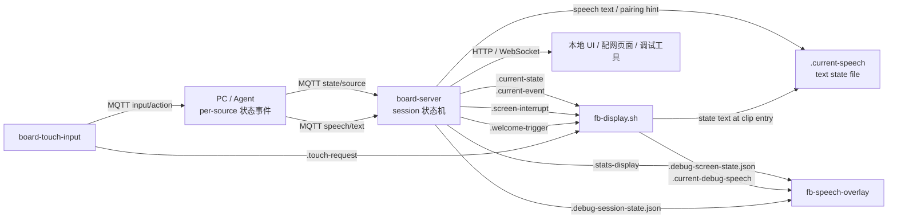

# 设备端整体设计说明

本文记录当前设备端 runtime 的整体设计。状态机细节不在本文重复展开，相关内容请参考：

- [屏幕状态机设计说明](screen-state-machine.md)
- [Session 状态机设计说明](session-state-machine.md)

## 总体目标

设备端 runtime 负责把小屏开发板变成 OpenClaw 的宠物显示端。当前主线支持
Raspberry Pi OS + systemd 和 Radxa Cubie A7Z Debian + systemd。屏幕是
ILI9341 320x240 SPI framebuffer；Pi 侧触屏是 XPT2046/ADS7846，Radxa 侧触屏
overlay 还未作为默认部署启用。它需要完成：

- 配网和设备配对。
- 连接 MQTT broker。
- 消费桌面端 per-source session 状态事件，并在设备端解析 active session 状态。
- 播放宠物动画视频。
- 保留语音文本状态文件，并显示负一屏 dashboard / debug 信息；主屏不渲染字幕。
- 采集触屏输入并回传给上游。
- 提供本地 HTTP / WebSocket 调试和配网页面。

当前实现以本地进程和本地文件作为模块之间的稳定接口，避免各模块互相直接调用。

## 进程组成

设备端主要由这些常驻进程组成。

| 进程 | 文件 | 责任 |
|---|---|---|
| `board-server` | `src/board_server.c` + `src/runtime_session_state.c` | HTTP / WebSocket / MQTT / 配网 / 设备端 session 状态机 |
| `fb-display.sh` | `fb-display.sh` + `fb-rawvideo-blit.py` | 视频扫描、状态切换、ffmpeg 播放、framebuffer 写入 |
| `board-touch-input` | `src/board_touch_input.c` | 读取 `/dev/input`，上报触屏事件，触发本地 touch 动画 |
| `board-rotary-input` | `src/board_rotary_input.c` | 读取 GPIO 旋钮和按钮，切屏、语音 PTT 或转发 widget 事件 |
| `board-widget-runtime.py` | `board-widget-runtime.py` | 解释 `.clawpkg` widget，生成负一屏 payload |
| `board-voice-ptt.py` | `board-voice-ptt.py` | 顶部按钮按住说话并注入 input action |
| `fb-speech-overlay` | `src/fb_speech_overlay.c` | 在 32bpp framebuffer 上绘制负一屏 dashboard 和显式 debug overlay；主屏字幕默认不渲染，当前 Pi 的 16bpp 小屏会跳过 |

设备上由 systemd 管理 `board-runtime.service` 和 `board-widget-runtime.service`。
`board-runtime.service` 在 Raspberry Pi 上调用 `start-rpi.sh`，在 Radxa A7Z 上调用
`start-radxa-a733.sh`，编排主服务、显示和输入/语音相关进程。

## 运行目录

设备默认运行目录：

```text
/opt/board-runtime
```

常见文件和目录：

| 路径 | 说明 |
|---|---|
| `board-server` | 主服务二进制 |
| `board-touch-input` | 触屏输入二进制 |
| `fb-speech-overlay` | 负一屏/debug overlay 二进制 |
| `fb-display.sh` | 视频播放驱动脚本 |
| `terrier-clips/` | 当前使用的视频 clip 目录 |
| `terrier-clips-durations.tsv` | clip 时长表 |
| `device-config.json` | 设备 id 配置 |
| `network-config.json` | Wi-Fi / MQTT / desktop 绑定配置 |
| `ui/` | 配网页面和本地 UI 静态资源 |

## 模块交互

整体数据流如下：



核心约束：

- `fb-display.sh` 不直接订阅 MQTT。
- `board-touch-input` 不直接控制播放器。
- `fb-speech-overlay` 不理解业务状态，只渲染 stats payload 和显式 debug 文本；main 页不渲染 `.current-speech`。
- `board-server` 不直接播放视频，只写状态文件和 interrupt marker。

## 本地文件契约

模块之间主要通过运行目录下的点文件交互。

| 文件 | 写入方 | 读取方 | 说明 |
|---|---|---|---|
| `.current-state` | `board-server` | `fb-display.sh` / `fb-speech-overlay` | 设备端 session 状态机解析出的 canonical state |
| `.current-event` | `board-server` | `fb-speech-overlay` / debug | 当前 active record 的 event |
| `.current-speech` | `fb-display.sh` / `board-server` | 上游诊断 / 文本状态消费者 | 语音文本和状态文案点文件；`fb-display.sh` 在 clip 入口写入状态文案，speech topic 会按 session 聚合最近 30 秒回复后由 `board-server` 写入，配网提示也由 `board-server` 写入；主屏默认不渲染字幕 |
| `.welcome-trigger` | `board-server`（USB serial asset commit） | `fb-display.sh` | 新形象资产激活后的一次性 `welcome` marker；显示层只消费新 marker 一次，然后回到当前 session 状态 |
| `.screen-interrupt` | `board-server` | `fb-display.sh` | 屏幕硬打断 marker |
| `.touch-request` | `board-touch-input` | `fb-display.sh` | 本地 touch 动画请求 |
| `.debug-session-state.json` | `board-server` | HTTP debug / overlay | session 状态 debug 快照 |
| `.debug-screen-state.json` | `fb-display.sh` | HTTP debug / overlay | 屏幕状态机 debug 快照 |
| `.current-debug-speech` | `fb-display.sh` | `fb-speech-overlay` | 顶部 debug overlay 文本 |
| `.debug-overlay-enabled` | HTTP debug | `fb-display.sh` / `fb-speech-overlay` | debug overlay 开关 |
| `.screen-page` | `board-touch-input` / `board-server` | `fb-display.sh` / `fb-speech-overlay` | 屏幕轮播页号文本（`main` / `stats`），默认 `main` |
| `.button-config` | `board-server` | `board-touch-input` / `board-rotary-input` | Pet Manager 设备页通过 USB `control/command` 下发的完整按钮配置；输入驱动按 event 查 action 后执行系统切页、系统重置、语音 PTT 或转发负一屏 widget 事件 |
| `.widget-events` | `board-touch-input` / `board-rotary-input` | `board-widget-runtime.py` | 负一屏 widget 输入事件队列；完整按钮配置可把旋钮短按/长按/旋转等硬件事件重映射成 `screen.region.tap`、`screen.region.long_press` 或 `knob.rotate_cw / knob.rotate_ccw` |
| `.stats-display` | `board-server`（`runtime_stats_flush`） | `fb-speech-overlay` | `STATS_DASHBOARD_V1` 结构化统计 payload，`.screen-page=stats` 时由 overlay 绘制全屏仪表盘 |
| `stats/today.json` | `board-server` | 调试 / 远程拉取 | 当日 token 聚合（机器可读）|
| `stats/sessions.json` | `board-server` | `board-server` 重启 reload | 每个 (source, sessionKey) 的上次值，用于 delta 累加 |
| `stats/YYYY-MM-DD.json` | `board-server` | （历史） | 跨天 rollover 时归档昨日 today.json |

这些文件使用原子写入方式更新，避免读取方看到半截内容。统计相关文件的具体协议见 [stats-page.md](./stats-page.md)。

## 启动流程

设备启动后，`board-runtime.service` 调用板型对应的启动脚本负责：

1. 设置默认运行目录、设备 id、MQTT broker、AP 参数。
2. 运行 `board-selfcheck.sh` 做基础自检。
3. 在 Raspberry Pi 上设置 USB gadget；如果 `/dev/ttyGS0` 可用，则进入 USB direct-connect 模式。
4. 解析 framebuffer，默认自动优先选择 SPI 小屏（Pi 常见 `/dev/fb1`，Radxa 常见 `/dev/fb0`）。
5. 启动 `board-server`。
6. 启动 `fb-display.sh`。
7. 在 32bpp framebuffer 上启动 `fb-speech-overlay` 支持负一屏/debug overlay；当前 16bpp Pi 小屏会跳过。
8. 启动 `board-touch-input`。
9. 启动 `board-rotary-input`。
10. 启动 `board-voice-ptt.py`。
11. 在非 USB 且非系统托管 Wi-Fi 的环境下才启动 `board-network-watchdog.sh`。

`start.sh` 主要保留给旧式/手动调试。Raspberry Pi 完整运行以 `start-rpi.sh`
和 systemd unit 为准；Radxa Cubie A7Z 完整运行以 `start-radxa-a733.sh` 和
systemd unit 为准。

## 配网与网络

设备端配网由 `board-server` 和 shell helper 共同完成。Raspberry Pi 和 Radxa
Cubie A7Z 上 Wi-Fi 通常由系统服务托管，runtime 不会像旧平台那样主动杀
`wpa_supplicant`。Radxa 启动脚本会等待 `wlan0` 出现，并用 `wlan0` MAC 推导
默认 `PET_DEVICE_ID`。

相关脚本：

| 脚本 | 作用 |
|---|---|
| `board-ap-up.sh` | 拉起 AP 模式 |
| `board-ap-down.sh` | 关闭 AP 模式 |
| `board-sta-apply.sh` | 写入 STA 配置、连接 Wi-Fi、申请 DHCP |
| `board-wifi-scan.sh` | 扫描 Wi-Fi |
| `board-network-watchdog.sh` | 网络保活和 DHCP 检查 |

配网入口：

- `GET /pairing/state`
- `POST /pairing/apply-config`
- `POST /pairing/reset`
- `POST /pairing/ap-mode`

`network-config.json` 保存：

- `ssid`
- `password`
- `mqttUrl`
- `namespace`
- `desktopDeviceId`

配网完成后，`board-server` 会更新 MQTT topic 绑定，并把屏幕状态写成 `idle` / `PairingReady`。屏幕状态机看到 `PairingReady` 后会播放一次 `welcome.mp4`。

## MQTT 连接

默认 broker：

```text
mqtt://broker.openclaw.example:1883
```

Raspberry Pi 启动时会先等待 USB gadget 枚举；自动模式只在 UDC 状态为
`configured` 且 `/dev/ttyGS0` 存在时使用 USB。若 `ttyGS0` 存在但 UDC 未配置，
该节点被视为 stale，运行时退回 MQTT，避免桌面端检测到串口但板端收不到状态。

默认 namespace：

```text
desk
```

主要 topic：

| Topic | 方向 | 说明 |
|---|---|---|
| `desk/<targetDeviceId>/state/+` | 订阅 | 桌面端 per-source session 状态事件 |
| `desk/<targetDeviceId>/state/active` | 默认忽略 / 兼容订阅 | 旧版 active 状态；仅 `BOARD_ACCEPT_LEGACY_ACTIVE=1` 时消费 |
| `desk/<targetDeviceId>/speech/text` | 订阅 | 上游语音文本；支持 `source` + `sessionId` / `runId` / `sessionKey`，设备端按 session 保留最近 30 秒回复并写入 `.current-speech`，主屏默认不显示字幕 |
| `desk/<localDeviceId>/control/remote-cli-binding` | 订阅 | 远端绑定更新；更新后设备会重订阅 `state/<targetSource>` 并重新发布 availability |
| `claw-pet/board/<boardDeviceId>/input/action` | 发布 / 订阅 | 触屏输入事件 |
| `claw-pet/board/<boardDeviceId>/hello` | 发布 retained | 设备 hello |
| `claw-pet/board/<boardDeviceId>/availability` | 发布 retained / will | 在线状态 |
| `claw-pet/board/<boardDeviceId>/control/command` | 订阅 | 设备控制命令，例如 factory reset |

session 状态的解析和归一化见 [Session 状态机设计说明](session-state-machine.md)。

## 显示系统

显示系统由两部分组成：

- `fb-display.sh` 使用 ffmpeg 解码视频，并通过 `fb-rawvideo-blit.py` 写入 framebuffer。
- `fb-speech-overlay` 可直接写 32bpp framebuffer 显示负一屏 dashboard 和显式 debug overlay；当前 Pi 小屏是 16bpp 时会跳过。

视频素材要求：

```text
terrier-clips/<state>[.<variant>].mp4
```

`fb-display.sh` 启动时动态扫描 `terrier-clips/*.mp4`，不需要为新增 variant 改代码。clip 时长优先来自 `terrier-clips-durations.tsv`。
当前仓库的内置默认素材仍使用 `terrier-clips` 兼容路径，但视频内容已由桌面端乌萨奇自定义形象导出并转成板端友好的 `800x480`、`24fps`、黑底 H.264 MP4。

屏幕状态机的完整切换规则见 [屏幕状态机设计说明](screen-state-machine.md)。

## 触屏输入

`board-touch-input` 负责：

- 自动检测 `/dev/input` 触屏设备。
- 识别 tap、long press、swipe。
- 发布 MQTT input action。
- 写入 `.touch-request` 触发本地 touch 动画。

touch 动画是屏幕本地抢占事件，不属于上游 session 状态。

## HTTP / WebSocket

`board-server` 提供 HTTP 服务，默认监听：

```text
0.0.0.0:80
```

主要接口：

| 接口 | 说明 |
|---|---|
| `/` | 正常 UI 或 AP 配网页面 |
| `/board-runtime-config.json` | 运行时配置 |
| `/pairing/state` | 配网状态 |
| `/pairing/apply-config` | 写入配网配置 |
| `/pairing/reset` | 重置配网 |
| `/pairing/ap-mode` | 手动切换 AP |
| `/debug/state` | debug 状态聚合 |
| `/debug/overlay` | 开关顶部 debug overlay |
| `/input/action` | HTTP 方式注入输入 action |

WebSocket 会向本地 UI 推送 MQTT bridge snapshot 和状态更新，主要用于调试和本地页面展示。

## Debug 设计

debug 有两个层次：

- HTTP 查询：`GET /debug/state`
- 屏幕顶部 overlay：`POST /debug/overlay {"enabled":true}`

debug 数据来自：

- `.debug-session-state.json`
- `.debug-screen-state.json`
- `.current-debug-speech`

overlay 打开后，屏幕顶部显示 session state 和 screen state，便于现场判断是桌面端事件问题、设备端 session 解析问题，还是屏幕播放问题。

## 部署与更新

常用脚本：

| 脚本 | 作用 |
|---|---|
| `install.sh` | 把当前目录安装到目标运行目录 |
| `scripts/deploy-rpi.sh` | 同步源码到 Raspberry Pi、远端构建、安装并重启 systemd 服务 |
| `scripts/deploy-radxa-a733.ps1` | 同步源码到 Radxa Cubie A7Z、远端构建、安装 systemd 服务，可选配置 SPI LCD overlay |
| `scripts/configure-radxa-a733-spi-lcd.ps1` | 写入 Radxa A7Z 专用 ILI9341/ST7789V SPI LCD overlay |

部署内容包括：

- native 二进制
- shell 脚本
- UI 静态资源
- `terrier-clips`
- `terrier-clips-durations.tsv`
- systemd unit 和板型启动脚本

## 自检与故障定位

基础自检：

```sh
./check-runtime.sh
```

`board-server` 也支持：

```sh
./board-server --self-check .
./board-server --self-check-json .
```

现场排查建议：

1. 查看进程是否都在：`board-server`、`fb-display.sh`、`board-touch-input`、`board-rotary-input`、`board-voice-ptt.py`、`board-widget-runtime.py`。
2. 查询 `/debug/state`，确认 session 和 screen 状态是否一致。
3. 查看 `.current-state`，确认设备端 session 状态机是否解析出正确状态。
4. 查看 `.screen-interrupt`，确认是否触发硬打断。
5. 查看 `.touch-request`，确认触屏输入是否到达本地。
6. 查看 `.button-config` 和 `.widget-events`，确认设备页按钮配置是否通过 USB OTA 到达并被输入驱动消费。
7. 查看 `terrier-clips-durations.tsv`，确认新视频有 duration。

## 设计边界

当前设备端明确负责：

- 多 source/session records 聚合和优先级计算。
- `done` 的 3 秒过期计时。
- 收到桌面端 source 状态事件后可靠落地成本地文件。

当前设备端明确不负责：

- 生成或转码视频素材。
- 复杂 UI 交互逻辑。
- 在屏幕状态机里直接处理 MQTT。

当前设备端负责保证：

- 屏幕状态机按本地文件稳定播放视频。
- 需要即时响应的状态可以通过 `.screen-interrupt` 硬打断。
- debug 信息能区分 session 状态和 screen 状态。
- 触屏输入既能回传上游，也能触发本地即时反馈。

## 扩展点

后续扩展建议：

- 新增视频：只添加到 `terrier-clips` 并更新 duration 表。
- 新增同一 state 下的动画：使用 `<state>.<variant>.mp4` 命名，不新增 state。
- 新增 session event 映射：修改 `runtime_protocol.c` 的归一化逻辑，并补充单测。
- 新增 debug 字段：优先扩展 `.debug-session-state.json` 或 `.debug-screen-state.json`。
- 新增 session 状态字段：优先扩展 `runtime_session_state.c` 和 `.debug-session-state.json`。
- 新增 stats 字段（如电费换算 / 碳排放）：在 `runtime_stats.c` 计算 + 改 `.stats-display` payload；如果是纯文字字段，`fb-speech-overlay` 通常只需要把字段放进版式。
- 新增屏幕页（如成就墙）：扩展 `enum`，给页一个新文件契约，按"业务计算在 board-server / 渲染分支在 overlay"的模式落地。
