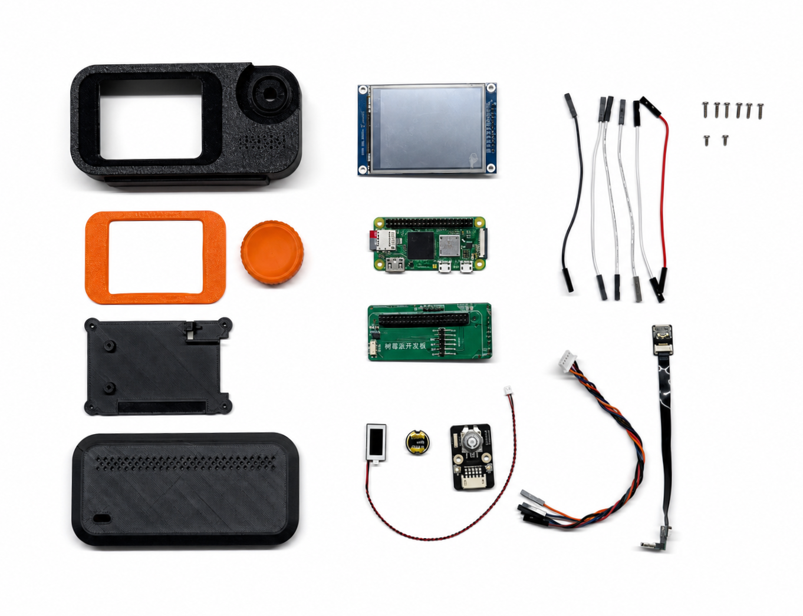
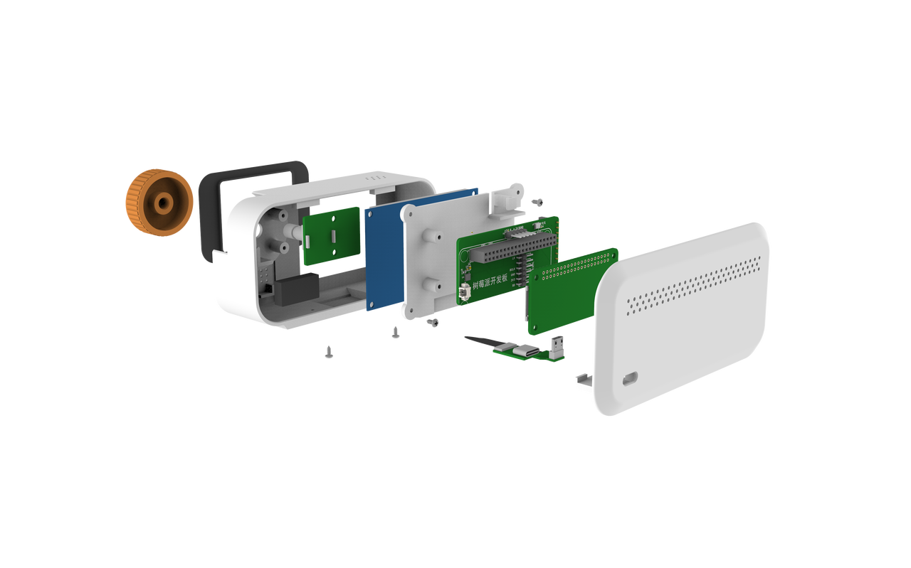
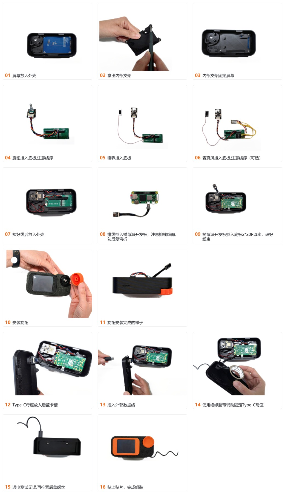
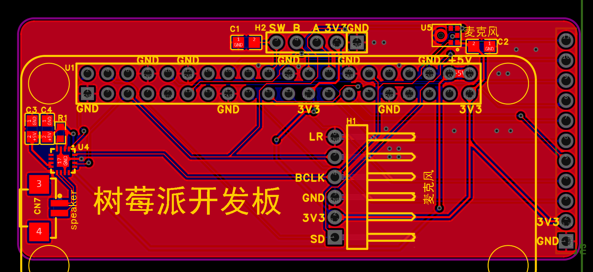
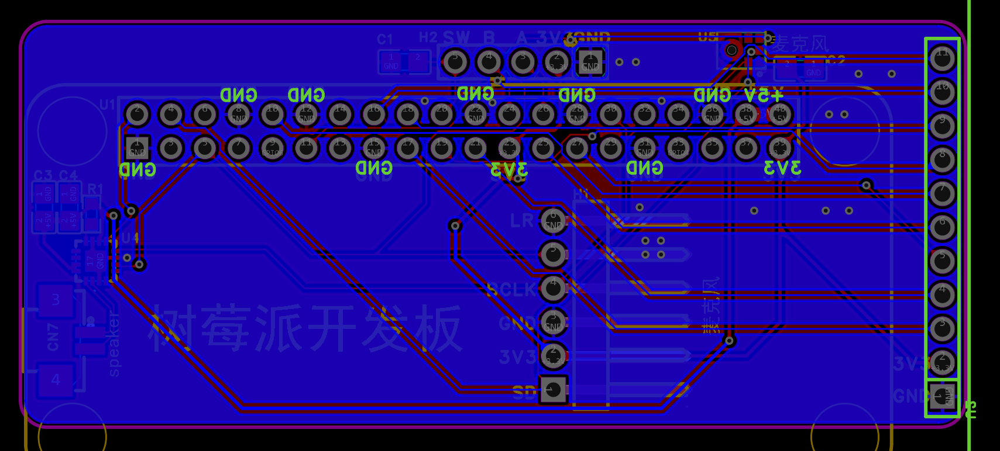

# 硬件复刻

[返回 README](../README.md)

本页收纳 Hachimiao 的硬件复刻资料，包括整机 BOM、结构件与装配、PCB 工艺信息。采购和打样前请结合工程文件再次核对型号、尺寸和供货状态。

## 硬件 BOM

### 方式一：立创商城一键下单

适合直接按底板工程与电子料 BOM 统一下单。正式发布前请替换为立创商城真实一键下单链接。

### 方式二：按表格自行购买

按下方整机物料表逐项核对采购。

| 类别 | 模块 / 器件 | 位号 / 接口 | 单套数量 | 备货总量 | 备注 |
| --- | --- | --- | ---: | ---: | --- |
| 开发板 | [Raspberry Pi Zero 2 WH][buy-pi] | 插入 U1 | 1 | 50 | 需预焊 40pin 排针版本 |
| SD 卡 | [microSD 卡][buy-sd] | TF 卡槽 | 1 | 50 | 32GB 以上，A1/A2 级别优先 |
| 屏幕 | [中景园电子 2.8寸 240x320 SPI TFT 触摸屏][buy-screen] | 插入 U2 | 1 | 50 | 以 11PIN 带 XPT2046 触摸版本为例；8PIN 无触摸版本作为同尺寸备选；选焊接排针、ILI9341 版本 |
| 旋钮 | [可按下旋钮模块 / EC11 编码器模块][buy-knob] | 接 H2 | 1 | 50 | 需和外观 ID 确认轴长、旋钮高度、安装方向和固定方式 |
| 麦克风模块 | [INMP441 麦克风模块][buy-mic] | 接 H1 | 1 | 50 | 若麦克风元件贴片成本过高，可采用外接模块方案 |
| 喇叭 | [1224 小腔体喇叭，1.25 端子，带双面胶][buy-speaker] | 接 CN7 | 1 | 50 | 1224，8 欧，1-2 W，1.25P |
| 线材辅料 | [杜邦线][buy-wire] | 按钮 / 旋钮 / 麦克风 | 15 | 750 | 20 cm 左右，母对母 |
| 结构辅料 | [自攻螺丝 M2 * 8 mm][buy-screw] | 屏幕固定 | 4 | 200 | 用于固定屏幕 |
| 结构辅料 | [自攻螺丝 M2 * 5 mm][buy-screw] | 结构固定 | 8 | 400 | 用于固定其他构件 |
| 外壳结构 | [3D 打印 / CNC 外壳][buy-shell] | 整机结构 | 1 | 50 | 外壳、后盖、内部固定支架 |
| 转接线 | [Micro-USB 公转 Type-C 母转接线][buy-micro-usb] | 内部开发板引出 | 1 | 50 | 10 cm；MicroUSB 公上弯转 Type-C 母直 `[mic2-tpc1]` |
| 转接线 | [Type-C 转 Type-A 转接线][buy-typec-a] | 设备连接到电脑 | 1 | 50 | USB 2.0 即可，4 芯及以上，不能只是充电线 |
| 定制 PCB 底板 | 见工程内底板 BOM | 各模块连接中转，减少杜邦线 | - | - | 底板物料随 PCB 工程核对 |

> 采购说明：链接仅供复刻参考，价格、库存和售后以对应平台为准；批量制作前请先核对型号与供货。

## 结构件与装配

MakerWorld 模型下载链接将在发布前替换为真实页面。

## 板子工艺信息

| 项目 | 参数 |
| --- | --- |
| 关键厚度 | 1.6 mm |
| 板子层数 | 双层板 |
| 尺寸 | 71 mm * 30.5 mm |
| 焊接 | 音频处理部分（功放、麦克风）可能需要加热台；其余器件使用烙铁即可。若不需要音频交互，可考虑打裸板自行焊接排针排母，不影响产品核心功能。 |

[buy-pi]: https://item.taobao.com/item.htm?id=693613248231
[buy-sd]: https://detail.tmall.com/item.htm?id=848065818893
[buy-screen]: https://item.taobao.com/item.htm?id=526024381409
[buy-knob]: https://e.tb.cn/h.iForjxnIRX1llEz
[buy-mic]: https://e.tb.cn/h.izOC4n5sjGeIoAm
[buy-speaker]: https://e.tb.cn/h.ixBS9SgI6gFXrIx
[buy-wire]: https://so.szlcsc.com/global.html
[buy-screw]: https://item.taobao.com/item.htm?id=39761471376
[buy-shell]: https://www.jlc-3dp.cn/
[buy-micro-usb]: https://detail.tmall.com/item.htm?id=867489662609
[buy-typec-a]: https://item.taobao.com/item.htm?id=726410843702
