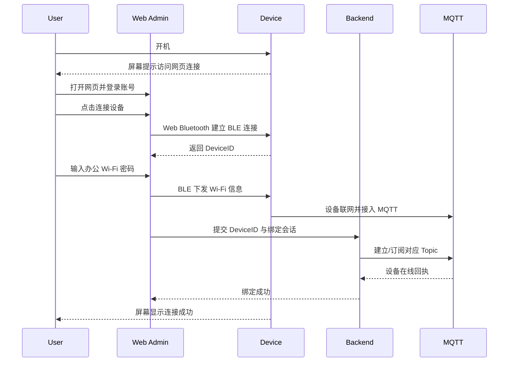

# [HachimoDock（哈基米机）](https://github.com/YizhengWw/HachimoDock) 轻量化管理端需求文档

> 状态：改进版草案  
> 适用范围：HachimoDock（哈基米机）配置与管理工作台 + `OpenClaw` 设备后台复用 + `pet-claw` 桌宠运行时联动 + 本机 `coding agent` 发现与绑定
> 更新时间：2026-04-14

> 当前原型口径：先收敛到 MVP，只保留三条主链路
> 1. 两个设备的连接
> 2. 设备管理
> 3. Channel 的展示与管理
> 当前运行时：`HachimoDock/ref` 已切到 `Tauri 2 + Vite/React` 桌面客户端壳，本地 agent 检测与 channel 配置持久化优先接入这个客户端。

## 1. 文档目标

本文档定义 HachimoDock（哈基米机）轻量化管理端的产品范围、页面结构、核心流程、系统链路和与现有系统的对接边界，供后续产品细化、前端原型、后端接口设计、硬件联调、桌宠应用联动和 `coding agent` 活动同步使用。

这份文档重点解决五件事：

1. 用户如何登录账号并进入管理端。
2. 用户如何通过 `Web Bluetooth` 在网页中完成设备绑定。
3. 用户如何在引导阶段发现并连接本机活跃的 `coding agent`。
4. 用户如何创建、生成、切换宠物形象并管理宠物成长。
5. 装扮系统、成就系统和 token 统计如何与现有 `pet-claw` 和 `coding agent` 事件联动。

## 2. 产品定位

当前前端原型已经收敛，不再把宠物档案、成就、复杂接入状态机作为第一优先级。MVP 先验证“电脑端 + 副屏设备 + Channel 管理”是否清晰可用，其他扩展能力放到下一阶段。

HachimoDock（哈基米机）不应只是一个“设备后台”，而应被定义为一个面向桌面开发场景的游戏化工作台。它服务于用户在电脑上使用 `coding agent` 工作时的可视化陪伴、状态同步和设备管理。

该产品主要用于：

- 承接现有 `OpenClaw` 管理端的设备基础管理能力。
- 补足个人用户视角的轻量体验，包括登录、绑定、宠物形象、成就、装扮、统计和工作台表达。
- 把用户电脑上的 `coding agent` 活动转译成“可观察的宠物行为、成长事件和工作统计”。
- 支持多种 `coding agent`，包括 `Claude Code`、`Codex`、`OpenClaw` 等，并允许后续扩展。
- 作为“设备端 + 云端 + 本地桌宠 + coding agent”之间的统一状态控制台。

核心原则：

- 浏览器即入口
- 绑定即联网
- 云端即同步
- 复用优先，不重造已有链路
- 工作即玩法
- Agent 即事件源
- 一处决策，多端同态

## 3. 当前系统边界

### 3.1 OpenClaw 管理端可复用范围

本项目不应另起一套设备后台。管理端应优先复用现有 `OpenClaw` 的设备与账号能力。

| 能力模块 | 当前应复用内容 | 管理端对接方式 | 本期说明 |
|---|---|---|---|
| 账号体系 | 用户身份、会话、鉴权 | 通过已有登录态或统一网关接入 | 管理端不自建账号中心 |
| 设备管理 | 设备列表、设备详情、在线状态 | 直接消费现有设备接口 | 作为 `/devices` 和 `/devices/:deviceId` 基础数据源 |
| 设备归属 | 用户和 `DeviceID` 绑定关系 | 走现有绑定接口或新增轻量绑定接口 | 绑定结果以后端为准 |
| 设备配置 | 备注、解绑、基础设置 | 复用现有配置下发链路 | 前端不自定义设备主键，也不透出全部 `OpenClaw` 配置项 |
| 固件/版本 | 固件版本、升级状态 | 复用现有版本接口 | 本期升级仅保留入口 |
| 云端链路 | MQTT Topic 映射、设备在线状态同步 | 沿用现有云端约定 | 管理端不直连 MQTT Broker |

### 3.2 `pet-claw` 桌宠应用当前现状

桌宠应用不是一个已经完整实现的“装扮系统”，而是一个已存在的桌面运行时，当前特征如下：

| 项 | 当前现状 | 对本方案的影响 |
|---|---|---|
| 运行形态 | Tauri 2.x + Node.js sidecar | 可以作为本地桥接端使用 |
| 角色表现 | 视频状态机驱动，资产包位于 `src/assets/pets/{pack}` | 当前更适合“角色包/主题包切换”，不适合直接承诺复杂服装分层 |
| 配置存储 | 本地 `pet-config.json`，由 `src/application/config/pet-config.js` 管理 | 可扩展为本地宠物形象/装扮缓存 |
| 实时通信 | 本地 HTTP Notifier + WebSocket 广播 | 适合承接管理端到桌宠的本地同步 |
| UI 现状 | 第一阶段已从桌宠内建 onboarding 转为外部 HachimoDock（哈基米机）管理 | `pet-claw` 只保留运行时占位态，完整配置与发现流程移到 HachimoDock（哈基米机） |
| 成就/装扮 | 当前只有 mock 数据，没有正式系统 | 本期文档必须把它定义成“新增能力” |

### 3.3 `coding agent` 活动的系统定位

`coding agent` 不是这套产品里的一个装饰模块，而是会直接影响宠物行为和页面叙事的核心活动源。

| 项 | 当前定位 | 对本方案的影响 |
|---|---|---|
| 运行位置 | 主要运行在用户电脑本地，未来可兼容云端 agent | 前端不内嵌 agent runtime，只消费标准化活动事件 |
| 活动形态 | 会话开始、任务规划、编码中、执行中、完成、阻塞、失败 | 可映射为宠物动作、情绪、特效和成长事件 |
| 数据粒度 | 会话、任务、步骤、结果摘要 | 页面展示“摘要 + 状态”，不直接展示原始终端流作为主视图 |
| 同步对象 | 网页工作台、本地桌宠、副屏设备 | 三端应共享统一 `CompanionState`，而不是各自猜测当前状态 |
| 接入方式 | 本地桥、统一事件协议、后端归档 | 需要定义 agent 事件模型和状态映射规则 |

### 3.4 多 `coding agent` 发现与绑定规则

第一阶段应支持发现并接入多个本机 `coding agent`，但同一时刻只允许一个“主活动 agent”驱动宠物状态。

| 规则项 | 规则说明 |
|---|---|
| 支持范围 | 第一阶段 UI 固定展示 `Claude Code`、`Codex`、`Copilot`、`Gemini`、`Cursor` 五类编码 agent |
| 发现方式 | 当前阶段使用前端 mock + API 契约；后续再切换到真实本地发现助手 |
| 连接方式 | 对 ready agent 提供一键继续，不要求用户先手动填复杂参数 |
| 继续规则 | 只要至少 1 个 agent 为 `ready`，用户就可以继续 |
| 多 agent 同时运行 | UI 会显示全部检测结果，但只允许在 `ready` agent 中选择主驱动 |
| 降级方式 | 未发现 ready agent 时，允许跳过连接，稍后手动接入 |

### 3.5 关键结论

- 设备管理应复用 `OpenClaw`。
- 装扮和成就不能假设 `pet-claw` 已经做完。
- 需要支持用户自行生成宠物角色、保存多个宠物档案，并切换当前活跃宠物。
- `pet-claw` 当前最适合承接的不是“任意服装叠层编辑”，而是“角色包、主题包、动作包、纪念品/成就展示”的第一阶段能力。
- `coding agent` 应被视为活动源，不应在轻量管理端里再造一套复杂 agent 控制台。
- 多个 `coding agent` 可以被发现，但同一时刻只允许当前活跃 agent 驱动宠物状态。
- token、任务结果和工作统计应成为成就系统和成长反馈的一部分。
- 副屏设备上的桌宠和电脑上的桌宠应共享同一个状态来源，只允许渲染方式不同，不允许状态语义不同。

### 3.6 第一阶段设备接入状态机约束

第一阶段的设备绑定页只做 `HachimoDock/ref` 内的前端原型，不接服务端、不接真实脚本、不接真实 MQTT。它的目标是先把“连接、识别、配网、登记、通道验证、完成态”这条用户路径和状态命名固定下来。

约束如下：

- 设备接入主状态统一使用 `setup_*` 命名，不再使用 `idle / ready / done / working / speaking` 这类容易和宠物行为重名的词。
- `pet_behavior_state` 只作为完成态中的保留字段展示，不参与接入流程判断。
- 绑定页所有流程判断只看 `setup_state`，子状态只作为总览卡的辅助信息。
- 第一阶段的设备接入页完全由前端 mock fixture 和状态机驱动，后续替换成真实脚本或服务端时不改状态模型。
- `pet-claw` 在这一阶段不参与设备接入流程实现，它只保留运行时展示职责。

## 4. MVP 范围

### 4.1 本期必须支持

1. 账号登录
2. 设备绑定
3. 本机 `coding agent` 主动发现与连接
4. 游戏化首页总览
5. 设备列表和设备详情
6. 宠物创建、生成与切换
7. 宠物成就页面
8. 宠物装扮页面
9. token / 工作统计展示
10. `coding agent` 活动状态接入
11. 与 `pet-claw` 桌宠应用的装扮与状态同步方案定义

### 4.2 本期不做

- 独立桌面管理端客户端
- 手机 App
- 多层实时服装编辑器
- 复杂商城、交易或社交系统
- 多设备批量运维后台
- 在网页内重做完整 `coding agent` IDE 或终端控制台
- 多 agent 协作编排和复杂任务编排系统
- 展示所有 `OpenClaw` 内部配置项、调试项和运维参数

## 5. 信息架构

### 5.1 页面形态原则

整体页面应采用“游戏化工作台”表达，而不是传统后台式密集管理界面。

- 一级页面负责展示状态、角色、事件和系统边界。
- 二级页面负责配置、详情、编辑和确认。
- 全局应有持续存在的工作台状态区，至少展示当前用户、当前主设备、当前宠物、当前 `coding agent` 会话和三端同步状态。
- 页面文案应尽量围绕“陪伴、工作进度、成长反馈”组织，而不是堆积低价值摘要数字。

### 5.2 路由与职责

| 页面 | 路由建议 | 主要职责 |
|---|---|---|
| 登录页 | `/login` | 登录账号，建立用户会话 |
| 工作引导 | `/workspace/connect` | 主动发现本机活跃的 `coding agent`，完成连接与主会话确认 |
| 首页总览 | `/dashboard` | 作为游戏化工作台首页，展示用户、设备、宠物、`coding agent` 和同步状态 |
| 设备列表 | `/devices` | 查看已绑定设备、在线状态和快捷管理入口 |
| 设备绑定向导 | `/devices/bind` | 完成 BLE 连接、Wi-Fi 配网和自动绑定 |
| 设备详情 | `/devices/:deviceId` | 展示设备状态、网络状态、版本、解绑等能力 |
| 宠物档案 | `/pet/profiles` | 管理多个宠物档案，切换当前活跃宠物，进入创建或编辑流程 |
| 创建形象 | `/pet/create` | 创建宠物名称、形象原型、初始配置 |
| 宠物成就 | `/pet/achievements` | 查看成就树、成长事件、奖励和由工作行为触发的里程碑 |
| 宠物装扮 | `/pet/dress-up` | 选择角色包、主题、动作方案，并同步设备/桌宠应用 |

## 6. 页面需求

### 6.1 登录页

#### 功能目标

让用户通过账号进入统一管理端，并建立“账号 - 设备 - 宠物”之间的归属关系。

#### 页面内容

- 产品简介
- 账号登录按钮
- 浏览器与设备连接说明入口
- 常见问题入口

#### 交互规则

1. 用户点击“账号登录”。
2. 完成授权或登录验证。
3. 管理端创建用户会话。
4. 若无设备，进入绑定向导。
5. 若已有设备但尚未连接本机 `coding agent`，进入工作引导。
6. 若已有设备且已存在有效 `AgentBinding`，进入首页总览。

#### 页面状态

- 未登录
- 登录中
- 登录成功
- 登录失败

### 6.2 工作引导 `/workspace/connect`

#### 功能目标

在用户完成登录后，主动展示本机 `coding agent` 发现结果，并帮助用户快速建立“当前主驱动 agent - 当前宠物状态 - 当前设备同步”的主链路。第一阶段先用 mock + API 契约推进前端产品形态，不要求真实本地发现助手先上线。

#### 页面内容

| 模块 | 展示内容 |
|---|---|
| 环境扫描区 | 当前扫描状态、mock 契约说明、演示场景切换 |
| 已发现 Agent 列表 | `Claude Code`、`Codex`、`Copilot`、`Gemini`、`Cursor` 五类 agent 的检测卡片 |
| 主会话确认区 | 当前默认选中的 ready agent、继续规则、当前阶段说明 |
| Advanced Settings | 折叠的 Base URL / API Key / Model 高级设置，不阻塞继续 |
| 跳过入口 | 允许先进入工作台，稍后再连接 agent |

#### 交互规则

1. 用户登录成功后，系统自动开始加载本机 agent 发现结果。
2. 若至少有一个 ready agent，则默认预选第一个 ready agent，用户确认后继续进入后续流程。
3. 若存在多个 ready agent，用户可以在 ready agent 之间切换主驱动；非 ready agent 只做信息展示。
4. 若没有 ready agent，则继续按钮禁用，但仍允许用户跳过，稍后再连接。
5. 当前阶段的发现结果全部来自 mock + API 契约，后续替换成真实本地发现助手时不改状态模型。
6. 在 `Channel 管理` 详情侧栏中，用户点击命令路径、配置路径或活动路径时，客户端应直接拉起本机 `Terminal.app` 执行校验命令，并仅展示简洁结果。
7. 命令路径校验需要同时检查“路径存在 + 文件可执行”；配置路径检查文件存在；活动路径检查目录存在。

#### 页面状态

- 扫描中
- 已发现且可连接
- 未发现可用 agent
- 本地发现助手不可用

### 6.3 首页总览 `/dashboard`

#### 功能目标

作为轻量管理端的默认首页，快速回答四个问题：

1. 我的 `coding agent` 现在在做什么。
2. 我的桌宠当前是什么形象、动作和成长状态。
3. 副屏设备和电脑本地桌宠是否与当前工作状态一致。
4. 当前是否存在需要我介入的异常或待确认事项。

#### 页面内容

| 模块 | 展示内容 |
|---|---|
| 用户卡片 | 头像、昵称、账号状态 |
| 工作会话卡 | 当前 `coding agent` 会话名称、任务标题、运行状态、最近动作、持续时长 |
| 工作统计卡 | 今日 tokens、本次会话 tokens、工具调用数、已完成任务数、估算成本 |
| 设备状态卡 | 默认设备名称、在线状态、最近在线时间、网络状态 |
| 宠物状态卡 | 当前名称、当前形象、当前动作、当前情绪、等级/成长摘要 |
| 同步状态卡 | 云端、本地桌宠、副屏设备三段同步结果和最近状态版本 |
| 事件时间线 | 最近的 agent 步骤、设备事件、成长事件和同步结果 |
| 待处理卡 | 当前阻塞项、待同步项、绑定未完成项、需要用户确认的操作 |

#### 设计要求

- 首页是“游戏化工作台 + 状态总览”，不是传统后台摘要页。
- 首页不应堆积低价值文案、重复数字或纯说明型卡片。
- `coding agent` 活动应成为首页的主叙事来源，宠物动作和页面氛围应围绕它变化。
- token 和工作统计应服务于反馈和成长，不应做成复杂计费后台。
- 绑定未完成时应突出展示绑定入口。
- 设备离线时应明确提示“可先改云端配置，设备上线后自动同步”。
- 当本地桌宠或副屏设备无法同步时，应保留当前工作进度显示，但把对应目标标记为待同步。

#### `coding agent` 与宠物状态映射建议

| Agent 状态 | 页面语义 | 宠物动作建议 | 副屏/桌宠表现 |
|---|---|---|---|
| `idle` | 待命中 | 休息、眨眼、轻微呼吸 | 低动态待机 |
| `planning` | 正在拆解任务 | 思考、观察、翻看道具 | 轻提示动画 |
| `coding` | 正在实现 | 专注、敲击、持续施工 | 主工作循环动画 |
| `running` | 正在验证 | 等待、紧张观察 | 验证中动画 |
| `success` | 已完成阶段结果 | 开心、庆祝、短反馈特效 | 成功反馈动画 |
| `blocked` | 需要用户介入 | 疑惑、求助、提示 | 明显提醒状态 |
| `failed` | 执行失败 | 失落、恢复、等待下一步 | 弱警示状态 |

### 6.4 设备绑定向导 `/devices/bind`

#### 功能目标

让用户在网页中一次性完成：

- 主机链路连接
- 副屏设备识别
- 插网线绑定或 Wi-Fi 配网的方式确认
- Wi-Fi 配网
- 设备登记与绑定验证
- 消息通道验证
- 完成态总览

#### 用户体验版本

从当前前端原型视角，绑定流程对用户展示为六段：

1. 选择绑定方式：页面上下展示两张卡片，先给出较轻量的“插网线绑定”，再给出主要的 Wi-Fi 配网流程。
2. 识别设备：读取 `board_device_id` 和设备标签。
3. 网络配置：插网线流程只需要“插线 → 点击检测绑定”；Wi-Fi 流程继续输入 Wi-Fi 并等待联网验证。
4. 绑定验证：完成设备登记、绑定持久化与消息通道校验。
5. 确认 agent 形象：设备登记和通信验证完成后，检测本机可用 CLI agent，只列出已检测到的渠道，并要求用户确认至少一个“agent 渠道 → 形象”的绑定；默认 Codex 绑定“西高地小狗”，其他检测到但未配置的 agent 留空。
6. 完成：保存 agent 与形象的 1v1 绑定，写入 bridge profile 并启动运行时，然后进入主界面。

#### 技术拆解版本

为了实现上述体验，当前原型内部维护的是一套显式 `setup_*` 状态机：

| 状态 | 说明 |
|---|---|
| `setup_wait_host_link` | 等待电脑连接副屏设备 |
| `setup_host_link_attached` | 已检测到主机链路，自动进入识别 |
| `setup_device_identifying` | 正在读取设备信息 |
| `setup_device_identified` | 已拿到 `board_device_id` |
| `setup_wait_network_input` | 等待输入 Wi-Fi |
| `setup_network_provisioning` | 正在下发 Wi-Fi 配置 |
| `setup_network_verifying` | 正在验证联网 |
| `setup_device_registering` | 正在登记设备标识 |
| `setup_binding_persisting` | 正在保存绑定关系 |
| `setup_channel_verifying` | 正在验证消息通道 |
| `setup_agent_appearance_confirming` | 正在确认检测到的 agent 渠道与形象 |
| `setup_completed` | 当前接入流程完成 |
| `setup_error_*` | 当前阶段失败，需要人工重试 |

子状态独立存在：

- `host_link_state`
- `network_state`
- `binding_state`
- `stream_state`

这些字段只用于右侧状态总览卡，不参与主流程步骤判断。

#### 前提条件

- 硬件支持 `BLE`
- 浏览器支持 `Web Bluetooth API`
- 用户使用 `Chrome` 或 `Edge`
- 设备可进入待绑定模式

#### 页面内容

- 原型场景切换条
- 六段式流程；当前 UI 步骤条收敛为“选择方式 / 网络绑定 / 验证通信 / 确认形象”四个用户可理解阶段
- 方式一：插网线绑定卡片，放在 Wi-Fi 卡片上方，流程短且按钮明确
- 方式二：Wi-Fi 配网卡片，保留原默认配网入口和 AP 热点说明
- 最后一步：检测本机 CLI agent，只展示已检测到的渠道，为每个渠道选择具体形象；没有检测到的渠道不罗列，只提供重新检测
- 当前主状态卡片
- Wi-Fi 配置表单
- 状态快照总览卡
- 失败恢复按钮
- 完成态 metrics 卡片

#### 异常处理

- 主机链路不稳定
- 设备识别失败
- Wi-Fi 配置错误或联网失败
- 设备登记失败
- 消息通道验证失败

#### 第一阶段实现说明

- 当前页只在 `HachimoDock/ref` 中实现，不接服务端和真实硬件脚本。
- 插网线入口先以前端 mock 方式走“检测连接 → 写入绑定信息 → 验证完成”，不新增接口；后续真实检测到网线时，可以自动进入该插线流程。
- 设备文案统一使用“副屏设备 / board / device”通用命名，不写死具体硬件型号。
- `wifi_password` 只保留在页面本地输入态，不写入最终 `DeviceSetupSnapshot`。
- 完成态会保留 `desktop_device_id`、`board_device_id`、`wifi_ssid`、`stream_state`、`pet_behavior_state` 和 metrics。
- 设备绑定验证完成后先进入管理端内的 agent 形象确认步骤；完成绑定后进入主界面，不再要求用户另去工作引导页配置第一份形象绑定。

#### 插网线真实链路草案

插网线绑定不应要求用户选择网络。真实流程可以收敛为：

1. 设备插入网线后通过 DHCP 获得局域网 IP，并在未绑定或绑定窗口内启动本地配对服务。
2. 管理端检测本机有线网络状态，同时通过 `mDNS` / UDP 广播发现设备；发现成功后可自动进入插线绑定页。
3. 管理端读取设备配对状态，至少拿到 `board_device_id`、`pairing_nonce`、`network_type=ethernet`、固件版本和设备局域网地址。
4. 管理端生成或读取 `desktop_device_id`，向设备发送绑定请求，携带一次性绑定会话、当前用户凭据、MQTT 命名空间和 Bridge 连接配置。
5. 设备校验 `pairing_nonce` 和绑定窗口，持久化 Bridge 配置，返回绑定确认。
6. 管理端保存本地绑定记录，并在需要时向服务端登记设备归属。
7. 管理端启动 Bridge，等待设备通过 MQTT 或局域网心跳上线。
8. 验证通过后进入完成态；验证失败时保留插线入口，提示重新检测或改走 Wi-Fi。

需要明确的失败分类：

- 未拿到 DHCP 地址
- 局域网发现不到设备
- 设备已绑定到其他账号
- 一次性配对凭据过期
- Bridge / MQTT 未上线
- 服务端归属登记失败

### 6.5 设备详情 `/devices/:deviceId`

#### 功能目标

提供现有 `OpenClaw` 管理能力的轻量视图。

#### 页面内容

- 设备名称、`DeviceID`、型号
- 在线状态、最近在线时间
- Wi-Fi 状态、固件版本
- 绑定账号信息
- 解绑入口
- 装扮同步状态
- `pet-claw` 联动状态
- 当前 `coding agent` 驱动下的目标状态版本

#### 设计约束

- 只展示用户可理解、可操作的设备信息。
- 不展示全部 `OpenClaw` 内部配置项、调试参数或运维视图。
- 当前前端原型保留左侧一级导航：设备页和“形象画廊”并列展示，用户可从一级 tab 直接进入形象列表、创建、导入和详情。
- 每个已绑定设备页仍展示当前形象卡片，并保留“管理形象”入口进入形象画廊；形象画廊的每张形象卡也可直接选择已检测到的 agent 渠道并应用到设备。
- Channel / 编程工具配置在设备页作为一级配置项展示：只列出已检测到的 `coding agent` 渠道，每个渠道内部选择一个具体形象；当前默认 Codex 绑定“西高地小狗”，已配置形象的 agent 排在上方，已检测到但未配置的 agent 统一列到下方并显示“未配置形象”，未检测到的 agent 不列出；下拉选择只作为草稿态，不触发桥接配置保存、设备运行时重启或分组重排，只有点击“应用到设备”才落盘并同步；CLI 路径、本地会话数据等检测细节默认不占用行内空间，只在 hover 时展示，并保留“重新扫描”入口；“形象画廊”仍保留为左侧一级 tab。
- 设备页的当前形象浏览与形象画廊卡片使用一致的预览样式和空态回退。
- 默认内置“西高地小狗”/Terrier clip 形象必须在本地形象目录为空或读取失败时仍可见；视频预览失败时回退到源图/缩略图，避免空白卡片。

### 6.6 宠物档案页面 `/pet/profiles`

#### 功能目标

支持用户维护多个宠物档案，并切换当前在网页、本地桌宠和副屏设备上生效的活跃宠物。

#### 页面内容

| 区块 | 说明 |
|---|---|
| 当前活跃宠物区 | 展示当前宠物名称、形象、最近状态、当前绑定的角色包 |
| 宠物列表区 | 展示所有已创建宠物，支持切换、编辑、归档 |
| 快速创建入口 | 创建新宠物或基于现有模板复制生成 |
| 切换确认区 | 切换宠物时提示会影响网页、本地桌宠、副屏设备 |

#### 交互规则

1. 用户可创建多个宠物档案。
2. 同一时刻只允许一个活跃宠物驱动三端显示。
3. 切换宠物后，系统重新计算当前 `CompanionState` 并同步到各端。
4. 若某端离线，则记录待同步状态，待上线后补发。

### 6.7 创建形象页面 `/pet/create`

#### 功能目标

为用户的桌宠建立第一份正式身份档案，并形成后续成就和装扮系统的基础对象。

#### 页面内容

| 区块 | 说明 |
|---|---|
| 预览区 | 实时显示当前形象效果，并提供桌面端 / 副屏端双视角预览 |
| 基础信息区 | 宠物名称、简介、性格标签 |
| 角色生成区 | 通过文本设定、模板或已有角色草稿生成宠物原型 |
| 角色原型区 | 选择角色包或基础形象，并映射到当前支持的运行资产 |
| 初始设定区 | 主色调、初始情绪、主题风格、默认待机风格 |
| 保存区 | 保存到云端并同步到设备/桌宠 |

#### 建议字段

- `petId`
- 宠物名称
- 角色设定 Prompt
- 角色来源类型（模板 / 用户生成 / 复制已有）
- 角色包 ID
- 主色调
- 性格标签
- 初始心情
- 默认主题
- 当前装扮方案 ID

#### 关键约束

- 本期“形象”优先绑定到角色包/主题包，而不是自由捏脸。
- 用户可以“生成角色设定”，但第一阶段生成结果仍需映射到受支持的角色包或主题模板，不能承诺任意生成后立即具备完整状态动画。
- 如果 `pet-claw` 当前仅支持整包视频资产，则页面上必须限制可选项，不要设计出桌宠应用无法落地的自由组合。
- 形象页定义的是“宠物身份层”，而不是实时行为层；实时动作仍由 `coding agent` 状态映射驱动。
- 自定义形象上传支持 PNG / JPEG / WebP / GIF，其中 GIF 作为首帧参考图进入生成流程；UI 必须明确提示这一点。
- 火山引擎生成链路需要单独的多模态 chat `Thinking 模型 endpoint`，不能把视频生成模型静默当作 thinking 模型回退；开始生成前必须给出可见的缺项提示。
- 生成流程默认启用“快速生成”：参考图先抠图，再合成黑色背景，统一放入宽 4 高 3 的参考帧画布（快速模式 320×240，标准模式 512×384），再交给视频模型生成动图；火山视频任务默认使用 fast 模型、2 秒短片、`ratio=4:3` 和 480p 输出；Kling 默认保持 standard/5s 并依赖 4:3 首尾帧约束，以更低清晰度和更小尺寸换取更快返回。用户需要更高清结果时可以关闭快速生成或手动覆盖参数。
- 自定义形象生成的每个动作 family 必须有可区分的动作语法：`welcome` 是一次性入场动作，允许从画面左/右/下方或边缘进入并落位；`idle.playing`、`idle.wandering` 等循环状态必须分别指定空间路径、身体轮廓和禁止复用的动作，允许从 screen-left 窜到 screen-right 或反向移动，不要求始终居中，避免全部塌缩成同一个坐姿眨眼。
- 动作 prompt 必须为每个 family 配置一个小型语义标志道具，例如 working 只能使用小键盘、小鼠标或小翻开的书/书页，并表现为打字、动鼠标或翻页，避免进度齿轮、抽象光效、光标方块等不真实办公道具；playing/wandering 的蝴蝶、小鸟、鲜花或叶子，waiting_user 的选择题/问号，done 的 finish 铃铛/完成标记；`touch.lick` / `touch.what` 是历史 ID，本质都是触屏反馈变体，应表现为宠物突然靠近镜头、脸部放大到前景、鼻子/脸颊/爪子轻触屏幕玻璃，并配合 tap ripple / screen smudge / glass shine 等小道具，而不是按名称生成字面动作或符号；道具必须服务动作、保持小且少，不应遮挡宠物、变成第二主角或生成可读文字。

### 6.8 宠物成就页面 `/pet/achievements`

#### 功能目标

让成就成为用户理解“设备已经陪伴我做了什么”的页面，而不是单纯的徽章收藏夹。

#### 页面内容

| 区块 | 说明 |
|---|---|
| 成就总览 | 总数、已解锁数、完成率 |
| 工作统计总览 | 今日 tokens、本周 tokens、累计会话数、成功任务数 |
| 最近成长事件 | 最近解锁、最近喂养、最近陪伴记录 |
| 成就列表 | 名称、描述、状态、奖励 |
| 奖励关联 | 解锁后可获得的装扮、动作、主题 |

#### 成就来源设计

成就数据建议由后台统一计算，来源包括：

- 设备侧事件：开机、绑定、在线、互动、连续陪伴
- 管理端事件：创建形象、切换装扮、完成配置
- `pet-claw` 桌宠事件：使用次数、播报次数、任务陪伴时长
- `coding agent` 事件：开始工作会话、完成任务、修复问题、连续专注时长、连续成功提交
- token / usage 统计：输入 tokens、输出 tokens、工具调用次数、工作连续性

#### 设计原则

- 成就源头可以多，但成就结果以后台为唯一真值。
- 不建议让前端自行判定成就达成。
- token 统计既可以用于成就，也可以用于工作反馈，但不应变成复杂财务报表。

### 6.9 宠物装扮页面 `/pet/dress-up`

#### 功能目标

提供一个能同时影响“无线副屏设备”和“本地桌宠应用”的装扮控制台，并定义哪些元素由用户配置、哪些元素由 `coding agent` 活动动态驱动。

#### 页面内容

| 区块 | 说明 |
|---|---|
| 当前形象区 | 展示当前角色包、主题、配件和最近同步状态 |
| 分类导航 | 角色包、主题、动作、配件、纪念品 |
| 资产列表 | 已拥有、未解锁、显影中、活动限定 |
| 预览区 | 设备预览图或桌宠预览图，并支持不同工作状态下的预览切换 |
| 操作区 | 试穿、保存、设为默认、同步、是否跟随 `coding agent` 状态自动切换动作 |

#### 本期装扮定义

考虑到 `pet-claw` 当前实现，本期装扮系统建议分为四类：

| 类型 | 含义 | 与 `pet-claw` 的关系 |
|---|---|---|
| 角色包 | 一组完整状态视频资产 | 直接映射 `src/assets/pets/{pack}` |
| 主题包 | 一组配色、文案、UI 氛围配置 | 可扩展到 `pet-config.json` |
| 动作包 | 补充特定状态动画或特殊循环 | 后续映射到状态资产或动作 manifest |
| 纪念品/徽章 | 展示型资产，不一定影响角色外观 | 可先复用 `souvenirs` 视图思路 |

#### 装扮与活动状态的职责分离

- 用户定义“身份层”：角色包、主题包、纪念品、默认偏好。
- 系统定义“行为层”：当前情绪、当前动作、当前提示效果。
- `coding agent` 事件驱动“行为层”变化，但不直接改写用户选择的角色包和主题包。
- 同一个角色包在第一阶段至少应覆盖 `idle / planning / coding / running / success / blocked / failed` 这些基本状态。

#### 不建议本期承诺的能力

- 任意多层服装叠穿
- 浏览器端高自由度逐层编辑
- 设备端和桌宠端完全一致的逐帧混合渲染

原因：`pet-claw` 当前是“整包视频资产播放”，不是可组合骨骼或图层渲染系统。

## 7. 连接与链路设计

### 7.1 总体链路

| 链路 | 职责 |
|---|---|
| 浏览器 ↔ 设备（BLE） | 设备发现、读取 `DeviceID`、下发 Wi-Fi 信息 |
| 浏览器 ↔ 后台（HTTPS） | 登录、页面数据获取、绑定确认、装扮保存 |
| 浏览器 ↔ 本地环境发现器 | 探测本机可用的 `coding agent` CLI / 本地服务 |
| 浏览器 ↔ Agent 事件源 | 读取当前 `coding agent` 会话、任务、token 统计和状态摘要 |
| 设备 ↔ 云端（Wi-Fi + MQTT） | 状态上报、在线心跳、指令接收 |
| 后台 ↔ MQTT | 设备 Topic 建立、消息订阅、下行控制 |
| 浏览器 ↔ `pet-claw` 本地桥 | 可选的本地桌宠同步 |
| `pet-claw` 内部 HTTP / WebSocket | 接收本地命令并刷新桌宠 UI |

### 7.2 本机 `coding agent` 发现与绑定

#### 目标

在尽量减少用户手动配置的前提下，主动发现本机活跃的 `coding agent`，并建立当前工作会话绑定。

#### 推荐流程

1. 用户登录完成后进入工作引导。
2. 页面调用本地环境发现器，扫描受支持的 agent CLI 或本地服务。
3. 系统返回已发现的 agent 列表，并标记活跃实例。
4. 若只有一个活跃实例，则默认预选并等待用户确认连接。
5. 若存在多个同时运行的 agent，则系统按“当前活跃”规则只选中一个主实例。
6. 连接成功后，系统开始接收会话事件、token 统计和状态变化。
7. 若后续主活动 agent 发生切换，系统更新 `AgentBinding` 并触发 `CompanionState` 重算。

#### 活跃 agent 选择规则建议

- 优先使用最近活动时间最新的实例。
- 若可获取前台窗口或聚焦终端信息，则前台实例优先。
- 若存在用户手动固定的主 agent，则手动选择优先于自动推断。
- 未被选中的 agent 保留在“已发现列表”中，但不驱动宠物状态。

### 7.3 设备绑定时序

### 7.4 装扮同步链路

#### 云端到设备

1. 用户在管理端选择装扮方案。
2. 浏览器通过 HTTPS 保存装扮方案到后台。
3. 后台将方案记录为该宠物当前默认装扮。
4. 若设备在线，后台通过 MQTT 下发装扮更新指令。
5. 设备回执成功后，管理端显示同步完成。

#### 云端到 `pet-claw` 桌宠应用

`pet-claw` 当前已具备本地桥接基础，建议采用“两段式同步”：

1. 云端保存为主：管理端先把装扮方案保存到后台。
2. 本地同步为辅：
   - 若本机安装且运行了 `pet-claw`，浏览器尝试调用其本地桥。
   - 浏览器请求本地 HTTP 桥接接口，将最新装扮方案推送给桌宠应用。
   - 桌宠应用更新本地配置，并通过本地 WebSocket 广播给主界面刷新。

#### 推荐的本地桥接方式

基于 `pet-claw` 当前结构，推荐沿用已有模式扩展：

| 现有能力 | 当前现状 | 推荐扩展 |
|---|---|---|
| `desktop-notifier` | 已支持本地 HTTP `/notify` | 增加 `pet_profile_updated`、`pet_outfit_apply` 等事件类型 |
| `webapp-ws-server` | 已支持本地广播 | 增加 `pet_profile_changed`、`pet_outfit_changed` 广播消息 |
| `pet-config.json` | 已存本地配置 | 扩展 `currentPetProfile`、`currentOutfitId`、`currentPackId` |

#### 装扮同步结果

保存装扮后，前端应区分三类状态：

- 云端已保存，设备已同步
- 云端已保存，设备待同步
- 云端已保存，`pet-claw` 本地桌宠待同步

### 7.5 `coding agent` 活动同步链路

`coding agent` 相关同步应采用“事件标准化 + 统一状态计算 + 多端分发”的模式，而不是让每个端自己判断。

1. `coding agent` 产生原始活动事件，例如任务开始、步骤完成、执行失败、等待确认。
2. 本地桥或后端把原始事件转成统一 `AgentActivity` 和 `TokenUsageSnapshot`。
3. 状态聚合层根据当前 `PetProfile`、`AgentActivity` 和活跃 `AgentBinding` 计算统一的 `CompanionState`。
4. 浏览器工作台消费 `CompanionState`，更新工作会话卡、事件时间线和宠物表现。
5. 浏览器同时更新 token / 使用统计卡、成就进度和成长反馈。
6. 若本地 `pet-claw` 在线，则通过本地桥下发当前状态版本。
7. 若副屏设备在线，则后台通过 MQTT 下发当前状态版本或动作指令。
8. 各端回执成功后，前端分别展示“网页已更新 / 本地桌宠已更新 / 副屏设备已更新”。

### 7.6 统一状态映射建议

为避免桌宠和副屏设备“看起来像两个不同角色”，建议抽象统一的 `CompanionState`：

| 字段 | 说明 |
|---|---|
| `stateVersion` | 当前状态版本号，用于三端对齐 |
| `sourceSessionId` | 当前驱动状态的 `coding agent` 会话 |
| `activityType` | 当前活动类型，如 `planning`、`coding`、`success` |
| `emotion` | 当前情绪语义，如 calm、focus、excited、stuck |
| `animationKey` | 渲染端应播放的动作键 |
| `reason` | 当前状态原因摘要，供网页解释使用 |
| `updatedAt` | 最近一次状态更新时间 |

## 8. 与 `pet-claw` 和 `coding agent` 的集成约束

### 8.1 当前可直接复用的实现

- 角色包资产目录：`src/assets/pets/{pack}`
- 视频状态流：`src/ui/windows/main/screen-config.js`
- 本地配置存储：`src/application/config/pet-config.js`
- 本地 HTTP 通知入口：`src/application/services/desktop-notifier.js`
- 本地 WebSocket 广播：`src/application/services/webapp-ws-server.js`

### 8.2 需要新增的实现

- 角色包 manifest，不再把所有角色映射硬编码在页面脚本里
- 正式装扮模型，不再只依赖 mock `souvenirs`
- 成就持久化和同步模型
- 多宠物档案模型与活跃宠物切换机制
- 本地桥接事件协议
- 设备端与桌宠端共享的装扮 ID 规范
- `coding agent` 统一事件协议
- 本机 agent 自动发现与连接机制
- `CompanionState` 计算和版本管理

### 8.3 与 `coding agent` 的集成边界

- 轻量管理端不直接承担 `coding agent` 的完整运行和控制逻辑。
- 第一阶段只要求消费标准化活动事件和结果摘要，不要求网页内嵌终端、diff 或完整任务流控制。
- 不同 `coding agent` 实现应先映射到统一事件协议，再接入产品层。
- 若同时存在多个会话，系统必须有“当前主会话”选择规则，避免桌宠行为抖动。
- 任何 agent 原始日志、命令、路径或敏感输出都不应直接作为桌宠表现输入。
- 前端不承担 `OpenClaw` 全量配置展示职责，只保留用户可理解的设备管理结果。

### 8.4 第一阶段落地建议

优先把装扮和活动同步能力收敛成“角色包切换 + 主题包切换 + 基础状态动作映射 + 成就奖励展示”：

1. 工作引导页先支持本机活跃 agent 自动发现和一键连接
2. 管理端保存 `currentPackId` 和当前活跃宠物
3. `pet-claw` 根据 `currentPackId` 切换到对应资产包
4. `coding agent` 事件先映射到有限状态集，而不是开放任意自定义动作
5. token 与会话统计先以摘要卡和成就统计形式展示
6. 奖励类装扮先作为“纪念品/主题/动作包”下发
7. 等角色 manifest 和状态事件协议稳定后，再考虑更细粒度服装系统

## 9. 数据模型建议

| 对象 | 关键字段 |
|---|---|
| User | `userId`、账号标识、昵称、头像 |
| Device | `deviceId`、名称、型号、在线状态、绑定用户、固件版本 |
| PetProfile | `petId`、`userId`、名称、性格、`currentPackId`、`currentThemeId`、`currentOutfitId`、`isActive`、`originType` |
| OutfitAsset | `assetId`、类型、名称、来源、解锁状态、预览资源 |
| OutfitPreset | `presetId`、`petId`、角色包、主题包、动作包、配件集合 |
| Achievement | `achievementId`、名称、描述、进度、解锁状态、奖励 |
| DesktopSyncState | `petId`、`desktopAppDetected`、`lastSyncAt`、`lastSyncStatus` |
| AgentSession | `sessionId`、来源、工作区、任务标题、状态、开始时间、最近活动时间 |
| AgentBinding | `bindingId`、`userId`、`activeAgentType`、`activeSessionId`、`discoveredAgents`、`updatedAt` |
| AgentActivity | `activityId`、`sessionId`、类型、摘要、严重级别、触发时间 |
| TokenUsageSnapshot | `sessionId`、输入 tokens、输出 tokens、总 tokens、工具调用数、估算成本、统计窗口 |
| CompanionState | `stateVersion`、`petId`、`sourceSessionId`、`activityType`、`emotion`、`animationKey`、`reason` |

## 10. 安全要求

### 10.1 登录与绑定

- 账号登录必须走正式授权流程，避免伪造用户态。
- 设备绑定必须绑定到当前会话用户，不能仅依据前端传参完成归属。

### 10.2 BLE 与 Wi-Fi 密码

- Wi-Fi 密码不得写入前端日志、埋点或浏览器长期存储。
- BLE 配网阶段需要会话级别保护，至少包含设备端随机挑战或一次性绑定会话标识。
- 若硬件支持，优先采用设备公钥/会话密钥加密 Wi-Fi 凭证，而不是直接明文透传。

### 10.3 DeviceID 与归属校验

- `DeviceID` 必须由设备通过 BLE 返回，前端不可自行构造。
- 后台在绑定时应校验设备激活状态、归属状态和一次性绑定上下文。
- MQTT Topic 不应只靠前端提交的 `DeviceID` 直接建立。

### 10.4 本地桌宠同步

- 浏览器调用本地 `pet-claw` 桥接接口时，只允许本机回环地址。
- 本地桥只接收白名单事件类型。
- 本地桥不得接受未经校验的任意文件路径或脚本执行参数。

### 10.5 `coding agent` 活动同步

- 若浏览器需要读取本地 `coding agent` 活动，只能通过受控本地桥或可信后端，不应直接读取任意本地进程输出。
- 用于驱动桌宠的活动字段必须经过白名单过滤和标准化，不能把原始终端日志直接透出到 UI。
- 状态映射逻辑应避免泄漏代码内容、密钥、路径和用户隐私信息。
- token 统计应只暴露聚合结果，不应回显敏感 prompt、完整上下文或源码片段。

## 11. 非功能性需求

### 11.1 浏览器兼容性

- 绑定流程仅保证 `Chrome` 和 `Edge`。
- 不支持 `Web Bluetooth` 的浏览器应明确降级提示，不进入后续流程。

### 11.2 性能

- 首页首屏加载目标：`< 2s` 展示骨架和基础状态。
- 绑定步骤切换响应目标：用户操作后 `300ms` 内反馈。
- 装扮保存后 `1s` 内给出“云端已保存”反馈。
- `coding agent` 状态变更后，网页工作台应在 `1s` 内反映。
- 本地桌宠在线时，状态同步目标应在 `1s` 到 `2s` 内完成。

### 11.3 离线与降级

- 设备离线时允许继续修改形象与装扮，待设备上线自动补同步。
- `pet-claw` 桌宠未安装或未运行时，不影响云端保存。
- 本地桥不可用时，前端只提示“桌宠待同步”，不阻断主流程。

### 11.4 可观测性

- 绑定链路必须记录步骤级日志和失败原因分类。
- 装扮同步必须区分云端、设备端、桌宠端三段状态。
- 成就计算应可追溯触发来源。
- `coding agent` 活动接入必须记录事件源、映射结果和最终下发状态版本。

## 12. 分阶段建议

### Phase 1

- 账号登录
- 本机活跃 `coding agent` 自动发现与连接
- 游戏化首页总览
- 设备列表/详情
- 设备绑定向导
- 宠物档案与活跃宠物切换
- 宠物基础生成流程
- token / 工作统计基础展示
- `coding agent` 基础状态接入
- 宠物基础状态映射

### Phase 2

- 创建形象页面完善
- 成就页面
- 装扮页面
- 云端到设备同步
- 本地桌宠状态同步

### Phase 3

- 与 `pet-claw` 本地桥深度联动
- 角色包 manifest
- 主题包/动作包扩展
- 成就奖励与装扮联动
- 多 agent / 多会话策略

## 13. 待确认问题

1. 账号登录具体接入方式是什么，是否已有统一 SSO。
2. `OpenClaw` 现有设备接口的字段和状态枚举是什么。
3. 设备 BLE GATT 服务中，`DeviceID`、Wi-Fi 配网和状态回执分别在哪些 Characteristic。
4. 设备是否支持装扮下发，还是只支持基础宠物配置。
5. `pet-claw` 桌宠端是直接拉取云端配置，还是由浏览器本地推送触发。
6. `pet-claw` 当前 WebSocket 默认端口在代码与 README 中存在 `18789/18790` 不一致，需要统一。
7. 装扮系统第一阶段是否仅支持角色包/主题包切换。
8. 成就是全部后端计算，还是允许桌宠端上报部分事件。
9. 第一阶段支持哪些 `coding agent`，事件源是本地桥、后端中转还是两者并存。
10. 多个 `coding agent` 会话同时存在时，谁是驱动桌宠的主会话。
11. `CompanionState` 的计算是在前端、本地桥还是后端完成。
12. 副屏设备端是否支持按 `animationKey` 播放状态动作，还是只能接收更粗粒度状态。
13. 用户生成的宠物角色是只生成设定与视觉草稿，还是允许后续接入 AI 资产生产链。
14. token 统计以哪类数据源为准，是 agent 本地桥、平台 API 账单，还是会话估算值。

## 14. 结论

这套轻量管理端应优先完成“登录 - 发现 agent - 绑定设备 - 建立宠物档案 - 工作台同步”闭环，其中设备管理复用 `OpenClaw`，但不展示全部 `OpenClaw` 配置；HachimoDock（哈基米机）负责配置、发现、绑定和管理，`pet-claw` 负责桌宠运行时与展示。
第一阶段不动服务端和 MQTT 新能力，更合理的实现边界是：先用 mock + API 契约把 agent 发现与继续规则走通，确保“至少 1 个 ready 即可继续”的产品链路成立，再在下一阶段无缝替换成真实本地发现助手。
