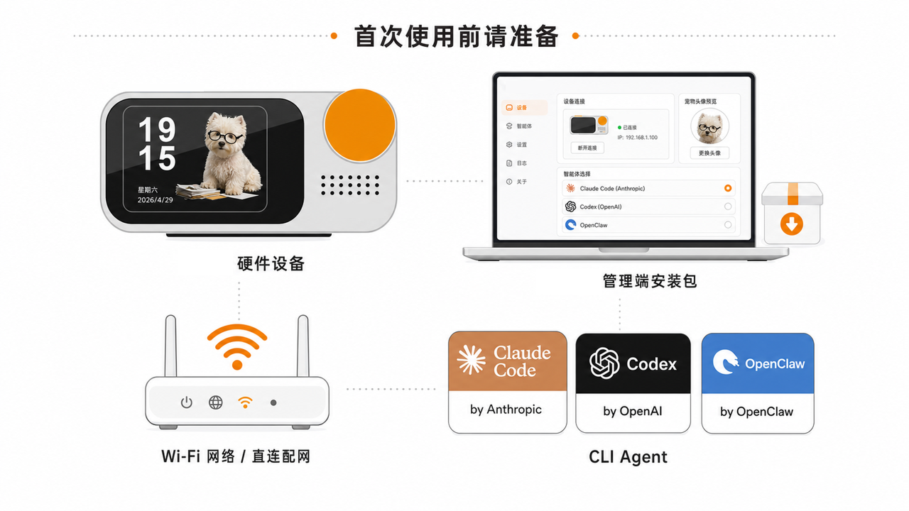
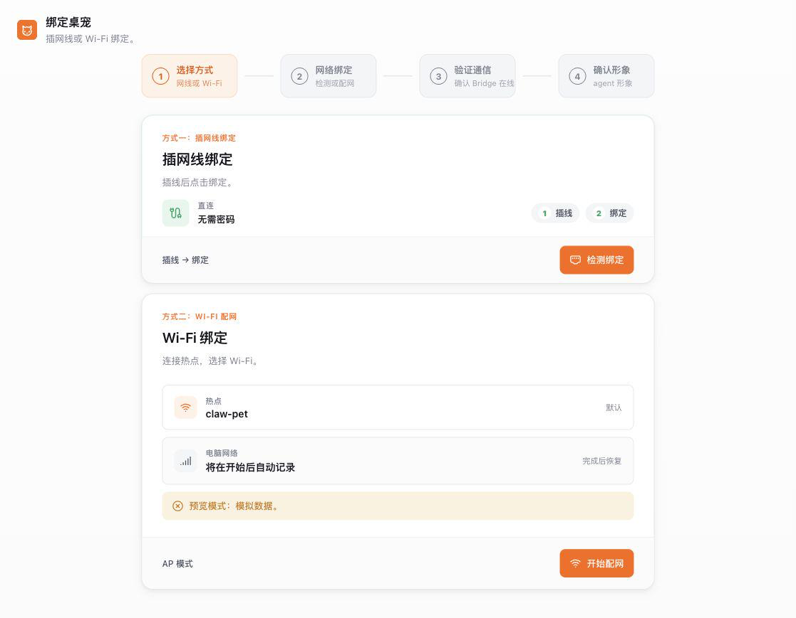
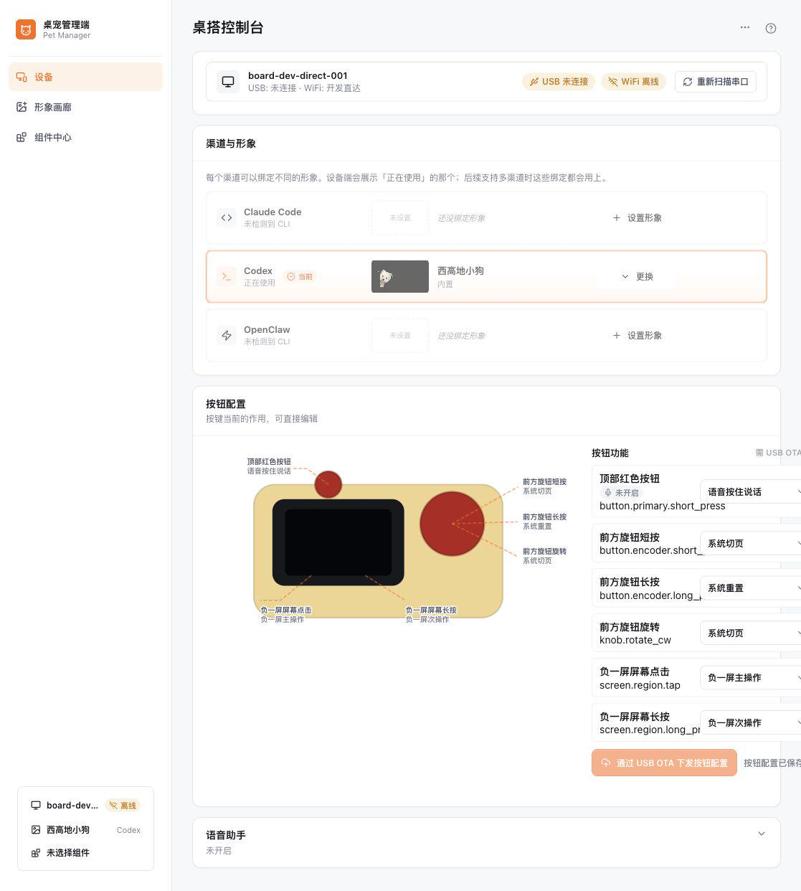
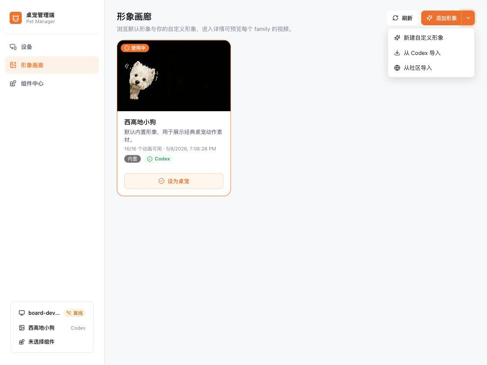
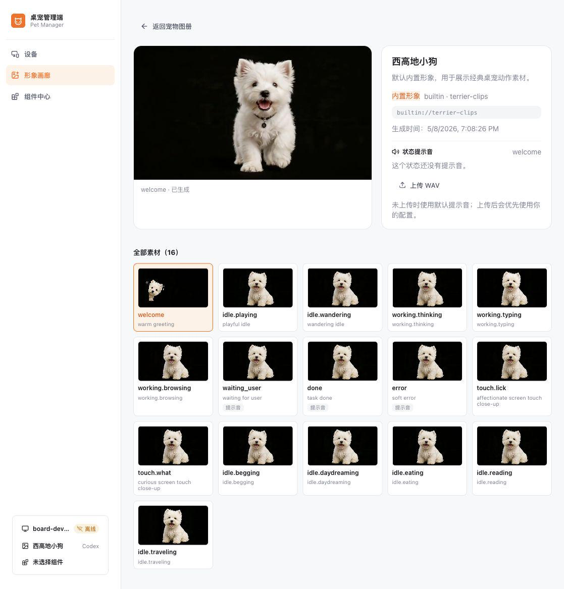
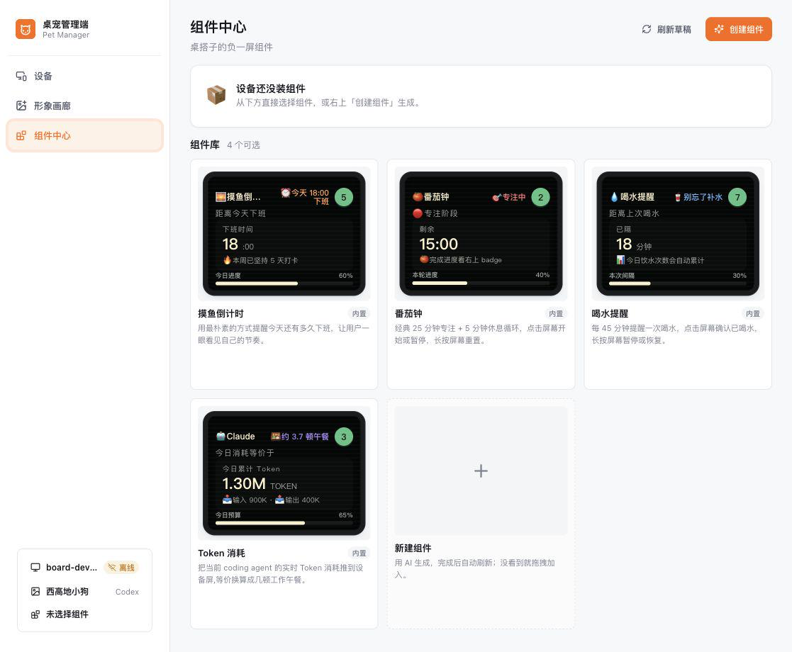
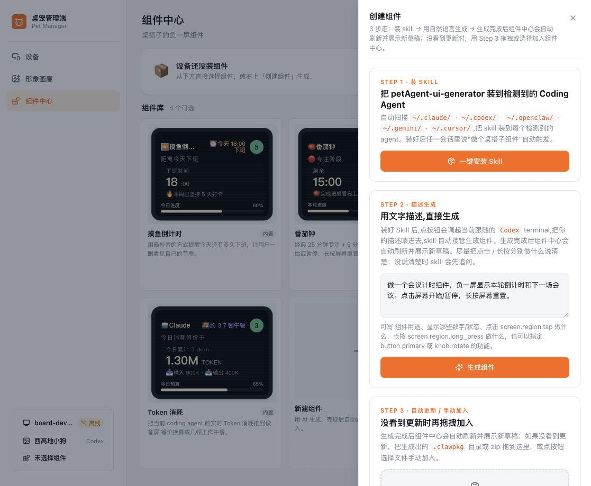

# 使用指南

[返回 README](../README.md)

完整的软件安装、构建、配置、二次开发和故障排查，请以项目文档为准。本页面面向已经拥有 HachimoDock 硬件设备，或已经按复刻教程完成装配的用户。

## 准备

- 设备端运行时已安装并能正常启动。
- PC 端已构建或安装 Pet Manager。
- 有可用 Wi-Fi 网络，或可进入设备 AP 直连环境。
- 至少有一个本机 CLI Agent：Codex、Claude Code、OpenClaw 等。

## 绑定设备

接通设备电源，等待设备进入首次启动状态。未绑定设备会进入等待连接或配网状态，屏幕显示待连接提示或默认宠物画面。打开 Pet Manager 客户端后进入设备绑定向导。

绑定向导分 4 步：

1. 选择方式（插线直连或 Wi-Fi）。
2. 网络绑定。
3. 验证通信，确认 Bridge 在线。
4. 确认形象。

两种连接方式：

- **插线直连绑定**：用数据线连接设备和电脑后点击“检测绑定”，管理端会扫描 USB 串口、读取设备 ID，并写入本机绑定记录；无需输入 Wi-Fi 密码。
- **Wi-Fi 配网**：电脑临时连接设备热点（默认 SSID `claw-pet`，默认密码 `88888888`），管理端经设备 AP（`192.168.44.1`）下发 Wi-Fi、MQTT、桌面设备 ID 与 namespace，设备再回到用户局域网；电脑网络在配网完成后自动恢复。

## Pet Manager 管理端主页

控制台聚合设备连接状态、渠道与形象、按钮配置和语音助手入口。

- **连接状态**：显示桌面设备 ID、USB 与 Wi-Fi 在线状态，可重新扫描串口。
- **渠道与形象**：Claude Code / Codex / OpenClaw 是固定渠道，页面只展示本机已检测到的 Agent；每个渠道可分别保存形象，同一时间设备端只跟随一个 Agent 的实时状态。
- **更多操作**：发送测试消息、复制桌面设备 ID、设备返回主屏、强制同步形象、通过 USB 配 Wi-Fi、解绑设备。

## 形象画廊与自定义形象

形象画廊用于浏览默认形象与自定义形象。进入详情可逐个预览每个状态的动画与状态提示音，也可以上传自定义 WAV。

“添加形象”支持三种方式：

- 新建自定义形象。
- 从 Codex 导入。
- 从社区导入。

内置“西高地小狗”形象（`builtin://terrier-clips`）共 16 个状态动画：

- **连接 / 欢迎**：`welcome`
- **工作**：`working.thinking`、`working.typing`、`working.browsing`
- **结果**：`waiting_user`、`done`、`error`
- **触摸反馈**：`touch.lick`、`touch.what`
- **空闲**：`idle.playing`、`idle.wandering`、`idle.begging`、`idle.daydreaming`、`idle.eating`、`idle.reading`、`idle.traveling`

自定义形象向导：

1. 上传参考图（PNG / JPEG / WebP / GIF，GIF 取首帧）。
2. 填写形象名称与性格描述。
3. 生成配置并同步到设备。

## 组件中心（设备负一屏）

组件中心是设备负一屏组件库。内置 4 个组件，并支持用 AI 生成新组件。

| 组件 | ID | 说明 |
| --- | --- | --- |
| Token 消耗 | `token-usage` | 把当前 coding agent 的实时 Token 消耗推到设备屏，切到负一屏后自动刷新。 |
| 摸鱼倒计时 | `slack-off-countdown` | 提醒今天还有多久下班，点击切换显示，长按重置倒计时。 |
| 番茄钟 | `tomato-clock` | 25 分钟专注 + 5 分钟休息循环，点击屏幕暂停 / 继续，长按重置。 |
| 喝水提醒 | `drink-reminder` | 默认按 60 分钟间隔计时提醒喝水，点击屏幕确认已喝，长按暂停或恢复。 |

点击组件可预览组件说明与按钮映射；安装时优先走在线设备通道，离线或不可达时会提示用 USB 数据线连接后推送。

创建组件分 3 步：

1. **装 Skill**：把 `petAgent-ui-generator` 装到检测到的 Coding Agent。管理端会自动扫描 `~/.claude/`、`~/.codex/`、`~/.openclaw/`、`~/.gemini/`、`~/.cursor/`。
2. **描述生成**：用自然语言描述组件用途、切到负一屏后的默认场景、显示什么数字 / 状态、点击与长按分别做什么，skill 调起当前跟随的 Agent 自动生成组件。
3. **自动更新 / 手动加入**：生成完成后组件中心自动刷新并展示新草稿；如果没看到更新，也可把 `.clawpkg` 目录或 zip 拖入，或用“选择文件”手动加入。

