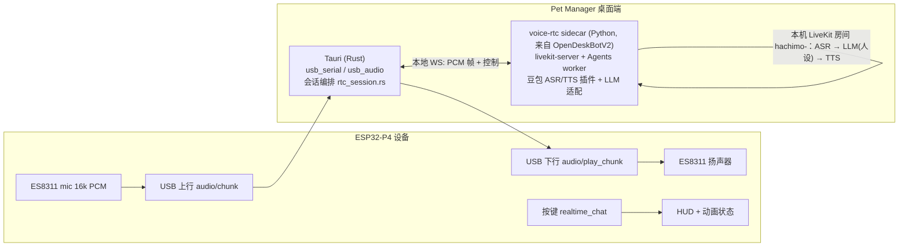

# 实时对话模式（形象人设 + 声音 + 双向语音）设计方案

> 本文保留早期方案讨论，不作为已实现功能清单。当前 0.1.60 / 0.7.56 的使用、实际架构和双端日志说明见 [实时对话：使用与排查](realtime-chat.md)。下文的 LiveKit/sidecar、旧目录、manifest 保存与热更新等设想不能视为当前实现。

> 状态：**方案（rev 3，实施中）** · 2026-09-18 · rev 3 变更：P1 不引入 Python sidecar / LiveKit，PC 端用 Rust 原生流水线（见 §8 末尾）
>
> 范围：Pet Manager 桌面端（`ref/`）、ESP32-P4 固件（`esp-p4-runtime/`）、新增语音 RTC sidecar。设备端与 PC 端配合完成。
> RTC 技术复用 OpenDeskBotV2（https://github.com/tudoom/OpenDeskBotV2#快速开始）已验证的本地 LiveKit 链路。

## 1. 背景与目标

现在设备上的语音只有一种用法：长按语音键录一段话，PC 端做 ASR，文本注入到当前 Code Agent 会话（`docs/voice-architecture.md` rev 4）。形象只是动画，没有"人格"，也不会说话。

目标：每个形象拥有自己的**人设**（system prompt 人格）和**声音**（TTS 音色），用户在设备的形象界面按一个键就能和这个形象**双向实时语音对话**（可打断、低延迟、边听边说）。设备负责采集与播放，PC 负责全部语音智能。

一句话：形象从"会动的贴纸"变成"能聊天的角色"。

## 2. 产品需求

### 2.1 形象画廊卡片

- 每张卡片右下角、与「删除」同一行，新增按钮 **「人设与声音」**（内置形象也有，只是不能删除）。
- 点击弹出 `PersonaVoiceModal`：
  - 人设：名字（默认取形象名）、一句话自我介绍、性格与说话风格（多行）、口头禅/称呼、语言（中/英/跟随）、禁止事项；右侧给 3 个模板（活泼/沉稳/毒舌）一键填入；底部显示"这段会作为它的 system prompt"。
  - 声音：首期只接豆包 Seed TTS 2.0（提供方固定为 `doubao_tts`，UI 不出现提供方选择；`voice.provider` 字段预留给以后）、音色下拉（内置音色表 + 已复刻音色）、语速、音量微调；「试听」按当前人设生成一句问候并播放（PC 扬声器）。
  - 保存写回该形象的 `manifest.json`；如果这个形象正在设备上使用且实时对话进行中，立即热更新（下一轮生效）。
- 卡片上多一行小字：`人设 · 音色名`；没配过的显示「未配置人设」并高亮按钮。

### 2.2 创建形象时必须设置

四条创建路径（创建向导 `CustomAvatarWizard`、MP4 上传创建、Codex 导入、社区导入）在最后一步前统一插入**「人设与声音」步骤**，复用同一个表单组件：

- 默认值：名字 = 形象名；自我介绍与性格由形象 `description` 自动生成初稿（本地模板拼接，不调大模型，保证离线可用）；音色 = 全局默认音色。
- 不填完不能完成创建（名字、性格、音色三项必填）。
- 旧形象没有这两个字段时按缺省补齐并在卡片上提示"未配置人设"，不阻塞使用。
- 内置「西高地小狗」出厂自带人设与默认音色（见 §5.1），用户可改；「恢复默认」回到出厂值。

### 2.3 快捷键：「实时对话」

- 「设备」页按键配置的动作列表（`BUTTON_FUNCTION_OPTIONS`）新增 `realtime_chat`，文案「实时对话」，说明「在宠物界面按下：进入/退出与当前形象的实时语音对话。组件界面或负一屏时无效」。
- 可绑到任意短按（SW1/SW2/SW3 短按、摇杆中按短按）。默认不绑定；首次配置人设后引导用户绑一个键。
- 设备处于形象界面（`screen_page == "main"`）时按下：进入实时对话；再按一次或 60 s 无人说话：退出。不在形象界面时按下：设备顶部提示"先回到形象界面"。

### 2.4 设备上的实时对话体验

| 状态 | 屏幕 | 声音 |
|---|---|---|
| 进入 | 顶部 HUD「实时对话 · <形象名>」+ 形象播放 listening 动画 | 形象用自己的声音说一句开场（人设里的问候） |
| 听 | 麦克风持续采集，HUD 显示音量条 | — |
| 想 | thinking 动画（有则用，无则 idle） | — |
| 说 | speaking/talk 动画（有则用），嘴型不做同步；设备屏不显示字幕 | 流式 TTS 播放 |
| 用户打断 | 立即停止播放，回到听 | 首期半双工：播放时不采集；二期开 AEC 后支持真打断 |
| 退出 | HUD 淡出，回到正常宠物界面 | 一句告别（可关） |

## 3. 现状盘点：能直接复用什么

### 3.1 HachimoDock 已有

| 已有能力 | 位置 | 复用方式 |
|---|---|---|
| 设备麦克风 16 kHz/16 bit/单声道，20 ms 一帧，经 USB 上行（`audio/begin|chunk|end`） | `esp-p4-runtime/main/pet_p4_audio.c`、`ref/src-tauri/src/usb_audio.rs` | 实时对话期间改为持续采集，帧格式不变 |
| ES8311 双工编解码器，已有播放任务（状态音效 WAV） | `pet_p4_audio.c` playback task | 增加"流式 PCM 播放"输入源 |
| USB 4 Mbaud，JSON 控制帧 + 8 KiB raw pack | `usb_serial.rs`、`pet_p4_transport_config.h` | 双向语音各 32 kB/s，raw pack 承载绰绰有余 |
| 按键绑定、`voice_ptt`、`voiceButton` 下发 | `DeviceDashboard.jsx`、`pet_p4_input.c` | 照样加 `realtime_chat` 动作 |
| 设备运行态 `screen_page`（main / stats / 负一屏） | `pet_p4_protocol.h` | 判断"处于形象界面" |
| 形象 `manifest.json`（已有 `persona` 元数据字段、`description`） | `codex_import.rs`、`lib.rs` | 扩展 `persona` / 新增 `voice` |
| 豆包 ASR 凭据与 API 配置页 | `volcengine_asr.rs`、`api-configuration.js` | 同一页新增大模型与 TTS 凭据 |
| PC 麦克风采集（cpal） | `pc_audio.rs` | 无设备时可用 PC 麦克风作为兜底端点 |

### 3.2 OpenDeskBotV2 已验证的 RTC 链路（直接搬）

| 模块 | 作用 |
|---|---|
| `local_livekit.py` | 本机拉起/看护 `livekit-server` 单二进制（mac 用 Homebrew bottle，Windows 用 `install_livekit_windows.ps1` 下载） |
| `rtc_agent_sdk.py` + `rtc_agent_entry.py` | 拉起 LiveKit Agents worker（团队维护的 `lampgo-livekit-agent-sdk`），每个设备一个房间、一个 Agent job |
| `rtc_livekit_plugins.py` | 豆包 Seed ASR（流式）/ Seed TTS 2.0（流式、复刻音色）的 LiveKit 插件，API-key 鉴权 |
| `rtc_llm_adapter.py` | OpenAI 兼容的对话 LLM 适配（DeepSeek / 豆包方舟 / MiMo），单趟联网 |
| `rtc_gateway.py` / `rtc_runtime.py` | 设备侧音频代理：把设备上行音频发布成房间里的参与者音轨，把 Agent 音轨拉回来下发设备 |
| `rtc_barge_in.py` | 打断时的回声语义保护（设备 AEC 是第一道防线） |
| `llm/prompt_assembly.py`（`assemble_rtc_system_prompt`） | 人设 + 行为规则拼装成语音 system prompt，≤50 字口语风格 |
| `speech_turn.py` | 中文半句判定，拉长端点等待 |
| 固件 `rtc_audio_downlink.cpp` / `opus_*` | 设备端流式播放与 Opus 收发（P4 这边改用 PCM，见 §7） |

OpenDeskBotV2 中设备是 ESP32-S3，用 Opus 走 USB/WiFi；HachimoDock 的 P4 已经用 PCM 走 USB，带宽足够，**首期不引入 Opus**，减少固件改动。

## 4. 总体架构



职责边界：

- **固件**只做三件事：持续采集、流式播放、按键/HUD/动画状态。不做 VAD、不做 ASR。
- **Tauri**负责会话编排：判断能否进入（形象界面、人设已配、凭据齐全）、拉起 sidecar、把设备 PCM 转发到 sidecar、把 Agent 音频写回设备、驱动 HUD 与动画状态、超时退出。
- **voice-rtc sidecar**负责所有语音智能：房间、Agent、ASR/LLM/TTS、端点与打断。它就是 OpenDeskBotV2 的 `rtc_*` 子系统抽成的独立进程，对外只有一个本地 HTTP/WS 控制口。房间只在本机回环上，不对外开放。

为什么用 LiveKit 而不是 PC 本地直接串 ASR→LLM→TTS：Agents 框架自带端点检测、打断、流式 TTS 编排，OpenDeskBotV2 已经把坑踩完，整套直接搬比重写一条流水线省时且更稳。代价是本机多一个 livekit-server 进程，全部走回环，不依赖网络。

## 5. 数据模型

每个形象目录下一个独立文件 `custom-appearances/<id>/persona-voice.json`（内置西高地也在自己的目录里，与 `audio-overrides.json` 同级）。不写进 `manifest.json`，因为 Codex 导入和内置形象初始化会重写 manifest，独立文件不会被覆盖：

```json
{
  "persona": {
    "schema_version": 1,
    "display_name": "Apex Nessie",
    "intro": "一只好奇又温柔的绿色长颈小水怪，陪你写代码、思考和摸鱼。",
    "style": "语气轻快，爱用比喻，句子短；被夸会害羞。",
    "address": "叫用户「船长」",
    "language": "zh",
    "forbidden": "不聊政治；不假装知道不知道的事",
    "greeting": "船长，今天想聊点什么？",
    "source": "codex-import"
  },
  "voice": {
    "provider": "doubao_tts",
    "speaker": "zh_female_wanwanxiaohe_moon_bigtts",
    "clone_speaker_id": "",
    "speed": 1.0,
    "volume": 1.0
  }
}
```

### 5.1 内置「西高地小狗」的出厂人设与音色（先跑通流程用，可随时改）

```json
{
  "persona": {
    "schema_version": 1,
    "display_name": "小西",
    "intro": "一只住在你桌上的西高地白梗，精力充沛、忠诚又黏人，最喜欢陪你写代码。",
    "style": "句子短、热情、爱撒娇；偶尔在句尾加一个「汪」；被夸会得意，被冷落会小声嘀咕。",
    "address": "叫用户「主人」",
    "language": "zh",
    "forbidden": "不聊政治；不编造不知道的事；不长篇大论",
    "greeting": "汪！主人你来啦，今天想聊点什么？",
    "source": "builtin"
  },
  "voice": {
    "provider": "doubao_tts",
    "speaker": "zh_male_naiqimengwa_mars_bigtts",
    "clone_speaker_id": "",
    "speed": 1.05,
    "volume": 1.0
  }
}
```

音色取豆包内置的「奶气萌娃」（`zh_male_naiqimengwa_mars_bigtts`，OpenDeskBotV2 随包音色表里的现成 ID），全局默认音色也先用它。

- `persona` 现有的 `{source, pet_id}` 保留在同一对象里，向后兼容。
- 读取时缺字段一律按缺省补齐（`display_name = name`，`speaker = 全局默认`），前端标"未配置"。
- system prompt 由 `assemble_rtc_system_prompt` 同款拼装：人设正文 + 固定行为规则（口语、≤50 字、不输出 Markdown/表情符号/动作说明、不确定就说不确定）。

## 6. 会话状态机（PC 端 `rtc_session.rs`）

```text
idle ──按键──▶ preflight ──ok──▶ starting ──房间就绪──▶ live ──按键/超时──▶ stopping ──▶ idle
                            │ fail                                   │
                            └──▶ idle（设备 HUD 提示原因）           └── error ──▶ idle
```

- preflight：设备在线且在形象界面；当前形象已配置人设与声音；LLM/ASR/TTS 凭据齐全；sidecar 就绪（首次冷启动约 3～5 s，HUD 显示"准备中"）。
- starting：创建房间 `hachimo-<deviceId>`，签发两个 token（设备代理、Agent），派发 Agent job，metadata 带 `{appearance_id, persona, voice}`；固件切换到对话模式。
- live：设备 PCM → sidecar 发布；Agent 音轨 → 设备播放；Agent 状态事件（listening/thinking/speaking）→ 固件动画状态；人设/声音热更新经 metadata 更新。
- 退出条件：再按键、60 s 无人声、设备离开形象界面、USB 断开。
- 同一时间只允许一个实时对话会话；进行中禁用 `voice_ptt`（避免两条语音通路打架）。

## 7. 固件改动（esp-p4-runtime）

| 项 | 改动 |
|---|---|
| 对话模式 | 新控制消息 `audio/conversation {enabled, halfDuplex}`：enabled 时麦克风持续采集上行（不再等 hold），帧格式沿用 `audio/chunk`；关闭时回到 PTT 语义 |
| 流式播放 | 新消息 `audio/play_begin {sessionId, sampleRate:16000}` / raw pack `audio/play_chunk`（20 ms 一帧，可合并到 160 ms 一包）/ `audio/play_end` / `audio/play_flush`（打断用）。播放任务加一个环形缓冲，起播水位 200 ms，欠载补静音并上报 |
| 半双工 | 首期 `halfDuplex=true`：播放期间丢弃采集帧（不上行），播放结束 150 ms 后恢复；二期接 ESP-SR AFE（P4 已支持）做 AEC 后改为全双工 |
| 按键 | `realtime_chat` 加入动作表；仅 `screen_page == main` 时生成 `input/action {action:"realtime_chat"}` 事件，否则本地弹提示 |
| HUD 与动画 | `ui/conversation {state: preparing|listening|thinking|speaking|ended, name, hint}`：顶部 HUD、音量条；动画按状态选 family（listening/thinking/speaking 缺失时回退 idle） |
| 状态上报 | `audio/status` 增加 `conversation`、`playbackBufferMs`、`droppedFrames` |

USB 预算：上行 32 kB/s + 下行 32 kB/s + 控制帧，远低于 4 Mbaud（约 400 kB/s）。播放帧走 raw pack，不走 base64。

## 8. PC 端改动（ref/）

| 层 | 改动 |
|---|---|
| React `AppearanceGallery.jsx` | 卡片脚部加「人设与声音」按钮；卡片副标题显示人设状态 |
| React 新增 `PersonaVoiceModal.jsx` + `lib/persona-voice.js` | 表单、模板、缺省推导、试听、校验；被画廊、详情页、四条创建流程共用 |
| React `CustomAvatarWizard.jsx` 等创建流程 | 插入必填步骤 |
| React `DeviceDashboard.jsx` | `BUTTON_FUNCTION_OPTIONS` 增 `realtime_chat`；实时对话状态卡（进行中/最近一次/失败原因） |
| React 设置页 `api-configuration.js` | 新增「对话大模型」（OpenAI 兼容：DeepSeek / 豆包方舟 / MiMo 预设）与「豆包 TTS」凭据；ASR 沿用现有；内部分发版走 seed 预置，与 OpenDeskBotV2 同一套 key 名 |
| Rust `lib.rs` | `appearance_persona_voice_get/set` 命令；manifest 读写与缺省补齐 |
| Rust 新增 `rtc_session.rs` | §6 状态机；USB 音频转发；播放回写；HUD/动画事件；超时 |
| Rust `usb_audio.rs` | 从"录完一段"扩展为"持续帧流"模式，帧直接转发不再攒 30 s |
| Rust 新增 `voice_rtc_sidecar.rs` | 拉起/看护 sidecar 进程，健康检查，端口发现 |
| Node bridge | 不改。实时对话不经过 Agent Session Bus（见 §10） |
| 新增 `voice-rtc/`（打包为 sidecar） | 从 OpenDeskBotV2 抽出的 Python 子系统：`local_livekit`、`rtc_agent_sdk`、`rtc_livekit_plugins`、`rtc_llm_adapter`、`rtc_gateway`（音频入口改为本地 WS 的 PCM 流）、`prompt_assembly`、`speech_turn`；对外 `POST /session/start|stop`、`GET /health`、`WS /audio/<sessionId>`（上行 PCM 帧 / 下行 PCM 帧 + 状态事件）；只监听 127.0.0.1；随包带 CPython 运行时与 `livekit-server`（mac 约 +120 MB，Windows 约 +150 MB） |

不选 Node 版 `@livekit/agents` 重写的原因：豆包 Seed ASR/TTS 插件、单趟联网 LLM 适配、半句判定、打断保护在 Python 侧都已稳定，重写等于把 OpenDeskBotV2 的两个月再走一遍。体积代价可接受。

**rev 3 实施决定（2026-09-18）**：实际抽取时发现 OpenDeskBotV2 的 rtc 子系统与其 Core（设备会话、表情运行时、工具、配置中心）耦合很深，抽成独立 sidecar 的工作量与打包（CPython + livekit-server 双平台）都超过了直接在 Rust 里实现半双工流水线。P1 因此改为 **Rust 原生实现**，不引入 Python 与 LiveKit：

| 模块 | 作用 |
|---|---|
| `src-tauri/src/realtime_chat.rs` | 会话状态机、能量 VAD（300 ms 预滚、700 ms 静音断句、15 s 上限）、60 s 无人声退出、半双工、板端播放节奏控制（领先 ≤1.2 s）、`ui/conversation` HUD、Tauri 命令与事件 |
| `src-tauri/src/volcengine_asr.rs`（已有） | 豆包流式 ASR |
| `src-tauri/src/persona_llm.rs` | OpenAI 兼容流式对话 + 按句切分给 TTS |
| `src-tauri/src/doubao_tts.rs` | 豆包 Seed TTS 2.0 双向 WebSocket 协议（复用连接，复刻音色自动切 `seed-icl-2.0`） |
| `src-tauri/src/voice_chat_settings.rs` | 大模型与 TTS 凭据（`voice-chat-settings.json`，内部构建可编译期嵌入） |
| `src-tauri/src/pc_playback.rs` | 试听走 PC 扬声器 |

OpenDeskBotV2 的复用体现在协议与经验（豆包双向 TTS 帧格式、ASR 插件行为、半句/打断策略），而不是进程级复用。LiveKit 仍是 P2 全双工打断的备选。

## 9. 凭据与配置

| 用途 | 键 | 来源 |
|---|---|---|
| 对话大模型 | `LLM_BASE_URL` / `LLM_MODEL` / `LLM_API_KEY` | API 配置页；内部包 seed 预置 |
| ASR | 现有豆包 ASR 配置 | 沿用 |
| TTS | `DOUBAO_TTS_API_KEY` / `DOUBAO_TTS_RESOURCE_ID` / 默认音色 / 复刻音色 ID | API 配置页；内部包 seed 预置 |
| 全局默认音色 | 设置页一项，新形象缺省取它 | 本地 |

公开版一律不内置任何 key（与两个项目现有做法一致）；缺凭据时「实时对话」按键触发在设备上提示"先在电脑端配置语音服务"。

## 10. 与现有语音架构的关系

`docs/voice-architecture.md` rev 4 的核心不变量是"语音没有自己的 LLM，只是 Agent 会话的另一种输入"。实时对话**有意**违反这一条：它的大脑是形象人设，不是 Code Agent。处理方式：

- 明确为两条互不混用的通路：`voice_ptt`（语音指令 → Agent 会话，不变）与 `realtime_chat`（实时对话 → 形象人设）。
- 设备 HUD 永远标出当前处于哪条通路；实时对话进行中屏蔽 `voice_ptt`。
- 实时对话不经过 Agent Session Bus，不写 Agent 会话文件。
- 二期可选：人设里加一个开关"能看到我在干什么"，把当前 Agent 会话的状态摘要（不含代码）作为上下文喂给人设，让形象能聊"你刚才那个测试跑挂了"。
- 本方案落地时把 voice-architecture.md 升到 rev 5，加"实时对话通路"一节。

## 11. 分阶段计划

| 阶段 | 内容 | 产出 | 估时 |
|---|---|---|---|
| P0 | 数据模型 + 「人设与声音」弹窗 + 四条创建流程必填步骤 + 卡片按钮 + 试听（走 PC 扬声器） | 人设能配、能试听、能存 | 1 周 |
| P1 | voice-rtc sidecar 抽取与打包（mac/Win）、Tauri 会话编排、固件对话模式 + 流式播放 + `realtime_chat` 按键 + HUD/动画（半双工） | 设备上按键即可对话 | 3 周 |
| P2 | 人设/声音热更新、ESP-SR AFE 全双工打断、60 s 超时与失败提示打磨、对话字幕在 PC 端可看、形象 speaking 动画与出声对齐 | 可打断、体验打磨 | 2 周 |
| P3 | 形象嘴型/表情联动、Agent 上下文喂给人设、第二家 TTS 提供方 | 后续迭代 | 待定 |

P1 里固件与 sidecar 可并行，接口按 §7 的消息先定死，用 PC 麦克风（`pc_audio.rs`）先把 sidecar 跑通，再接设备。

## 12. 风险与对策

| 风险 | 对策 |
|---|---|
| P4 侧没有 AEC，扬声器声音回灌麦克风 | 首期半双工（播放时不采集），二期 ESP-SR AFE；sidecar 侧保留 `rtc_barge_in` 语义保护 |
| USB 串口抖动导致播放卡顿 | 播放帧 raw pack、160 ms 一包、设备 200 ms 起播水位、欠载补静音并上报，PC 端按 `playbackBufferMs` 调节发送节奏 |
| 端到端延迟 | 目标：用户说完 → 开始出声 ≤ 1.2 s（流式 ASR 端点 300 ms + LLM 首 token 400 ms + TTS 首包 300 ms）；OpenDeskBotV2 实测在此量级 |
| 安装包变大、sidecar 冷启动慢 | 随包预置 Python 运行时与 livekit-server；应用启动后后台预热 sidecar；首次进入对话时 HUD 显示"准备中" |
| Windows 上 livekit-server 与防火墙 | 复用 OpenDeskBotV2 的 Windows 安装脚本与 loopback 监听策略 |
| 两条语音通路混淆 | HUD 标注 + 互斥 + 文档 rev 5 |

## 13. 验收标准

1. 画廊每张卡片右下角有「人设与声音」，弹窗可编辑、试听、保存；重开应用后仍在。
2. 四条创建路径都必须填完人设与声音才能完成；旧形象显示"未配置"但可正常使用。
3. 按键配置里可把 SW1/2/3 短按或摇杆中按绑定到「实时对话」；下发设备后按键在形象界面进入对话，在组件界面提示无效。
4. 进入对话后形象先用自己的声音打招呼；用户说话 → 形象用其人设与音色回答；说完到出声 ≤ 1.5 s（内网、豆包服务正常）；连续对话 5 分钟无卡顿、无自我对话。
5. 再按键或 60 s 无人声退出，HUD 消失，`voice_ptt` 恢复可用。
6. 公开版不含任何凭据；缺凭据时设备提示而不是静默失败。

## 14. 已确认的决策（2026-09-18）

1. 内置「西高地小狗」出厂自带人设与默认音色，先按 §5.1 指定的值跑通流程，之后再调。
2. 声音首期只接豆包 Seed TTS 2.0，不做第二家；`voice.provider` 字段预留。
3. 对话字幕不上设备屏，只在 PC 端显示（P2 项）。
